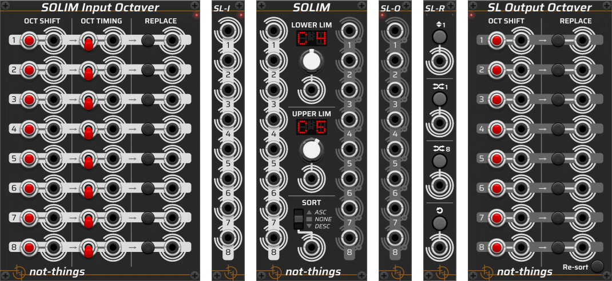

# not-things VCV Rack modules

## Modules
The list of modules in this plugin for [VCV Rack](https://github.com/VCVRack/Rack), a virtual Eurorack modular synthesizer platform:
* [SOLIM](./doc/SOLIM.md): A set of modules with a core idea of limiting note values to an octave range and sorting them

## Themes
All modules have a **light** and a **dark** theme version. By default, the *Follow VCV Panel Theme* option will be active, causing the modules to follow the global panel theme selection of VCV Rack (available in the *Module* section of the VCV Rack *View* menu). This can be changed on a per-module basis in the *Panel theme* submenu of the right-click menu of each module. 

## Acknowledgements
The automated build setup for Github in the `.github/workflows` folder has been created based on the information available VCV Rack community forum, mainly [this](https://community.vcvrack.com/t/automated-building-and-releasing-plugins-on-github-with-github-actions/11364) post, with user `qno` keeping the script up to date with the lastest changes.

## More About *not-things*
Check out [not-things.com](https://not-things.com)