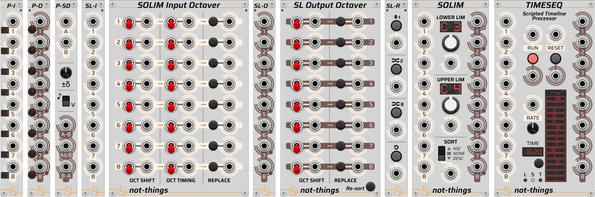
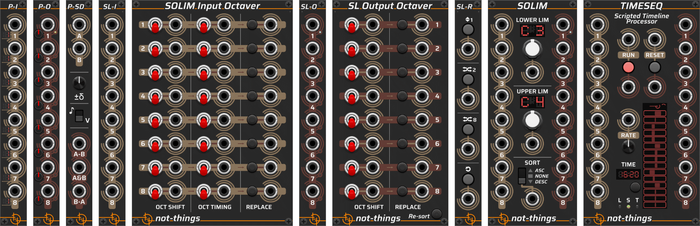

# not-things VCV Rack modules

A collection of modules for [VCV Rack](https://vcvrack.com/) (a virtual Eurorack modular synthesizer platform), available in the VCV Rack [plugin library](https://library.vcvrack.com/not-things)

## Modules

* [SOLIM](./doc/SOLIM.md): A set of modules with a core idea of limiting note values to an octave range and sorting them
* [TIMESEQ](./doc/TIMESEQ.md): A scripted timeline processor. Run simple sequences, more complex behavior, or a mix of both via a JSON script
* [PI-PO](./doc/PIPO.md): A set of modules for splitting and merging polyphonic and monophonic signals
* [P-SD](./doc/PSD.md): A module for determining the similarities and differences between two polyphonic signals

## Themes

All modules have a **light** and a **dark** theme version. By default, the *Follow VCV Panel Theme* option will be active, causing the modules to follow the global panel theme selection of VCV Rack (available in the *Module* section of the VCV Rack *View* menu). This can be changed on a per-module basis in the *Panel theme* submenu of the right-click menu of each module.

## More About *not-things*

Check out [not-things.com](https://not-things.com)

 