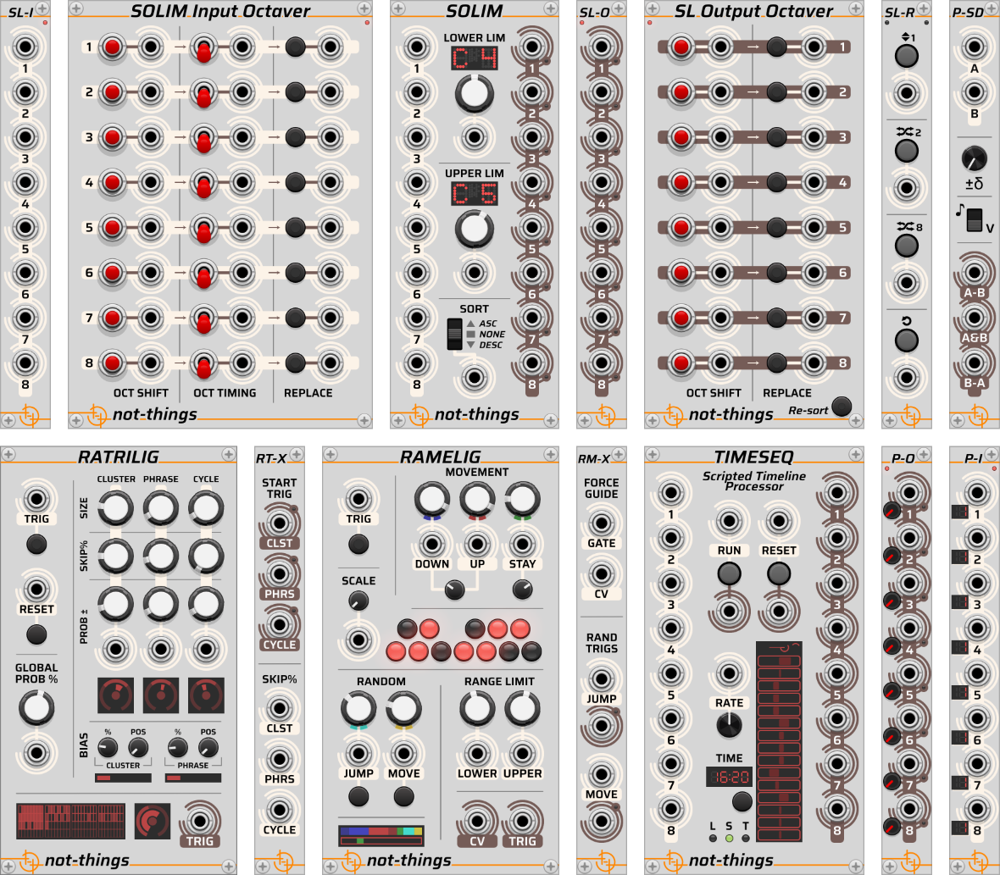
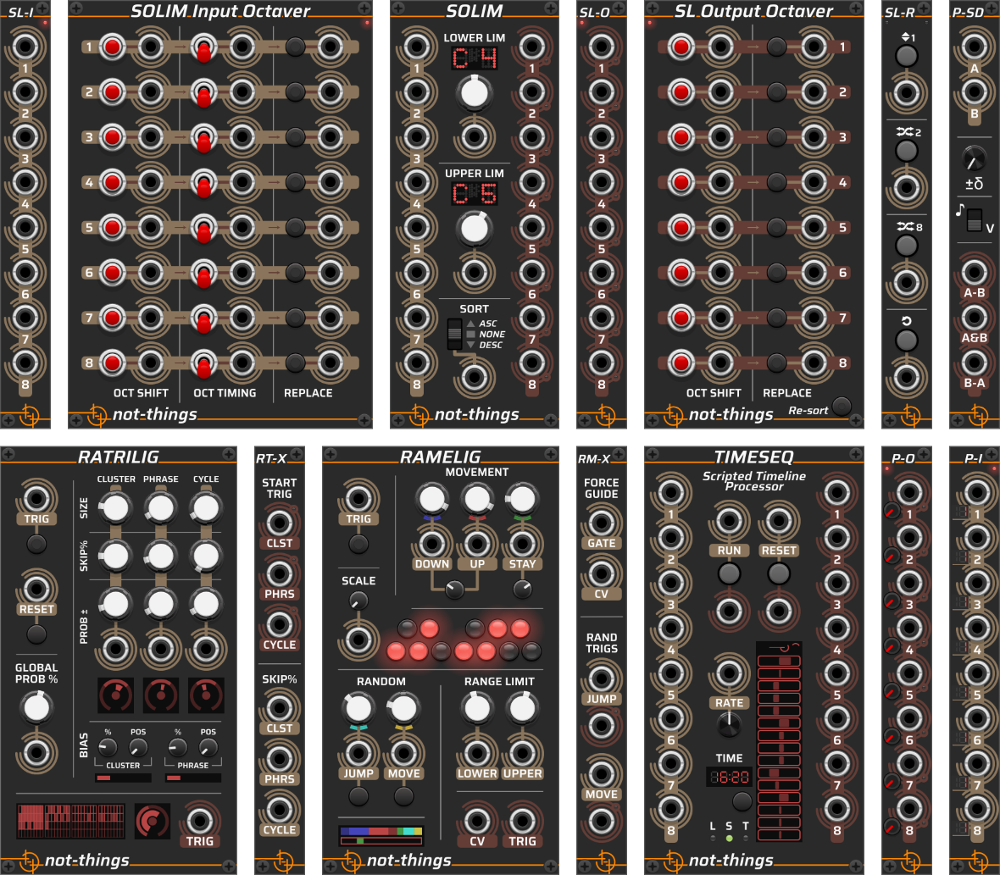

# not-things VCV Rack modules

These pages provide the documentation for the ***not-things*** set of VCV Rack modules.

## Modules

The list of modules in this plugin for [VCV Rack](https://github.com/VCVRack/Rack), a virtual Eurorack modular synthesizer platform:

* [SOLIM](SOLIM.md): A set of modules with a core idea of limiting note values to an octave range and sorting them
* [TIMESEQ](TIMESEQ.md): A scripted timeline processor. Run simple sequences, more complex behavior, or a mix of both via a JSON script
* [PI-PO](PIPO.md): A set of modules for splitting and merging polyphonic and monophonic signals
* [P-SD](PSD.md): A module for determining the similarities and differences between two polyphonic signals

## Themes

All modules have a **light** and a **dark** theme version. By default, the *Follow VCV Panel Theme* option will be active, causing the modules to follow the global panel theme selection of VCV Rack (available in the *Module* section of the VCV Rack *View* menu). This can be changed on a per-module basis in the *Panel theme* submenu of the right-click menu of each module.

## More About *not-things*

Check out [not-things.com](https://not-things.com)
