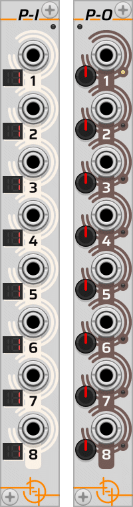
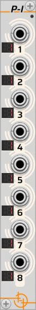
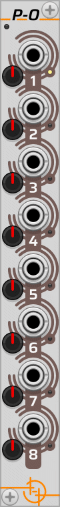

# PI-PO

*Part of the set of [not-things VCV Rack](../README.md) modules.*

The Pi-Po modules allow multiple polyphonic (or monophonic) signals to be split and merged into new monophonic or polyphonic signals.

To achieve this effect, the Polyphonic Input (*P-I*) module takes all the channels of the individual incoming signals, and provides them as a combined list to the Polyphonic Output (*P-O*) module. The *P-O* module will construct new monophonic or polyphonic outputs by taking the available channels from the list and assigning them in order on the output ports, with a dial specifying how many channels each output port should receive.

## P-I (Polyphonic Input module)

This module has eight input ports to which input signals can be connected. A LED display next to each port shows how many channels are present in the input signal.

Each input can receive between 1 and 16 channels. If no cable is connected to the port, it is treated as a single-channel input that is always set to 0V. The *P-I* module processes each of its inputs in order, adding their channel(s) to the list of channels that the *P-O* module can use for its outputs.

## P-O (Polyphonic Output module)

This module has eight output ports. Each output has a dial on its left side that determines how many channels are assigned to it. Each output can receive between 1 and 16 channels.

The *P-O* module will use the list of channels constructed by the *P-I* module and assign the appropriate number of channels to each of its output, processing outputs from top to bottom and channels from start to finish. An output does not have to be connected to get channels assigned to it. Even if no connection is present, the amount of channels specified on the dial for that output will still be assigned to the output.

It does not matter to the *P-O* module if the input channels came from the same input port or not. Because the number of output channels can be set for each separate output port, it is possible that the channels from one input port on the *P-I* module end up spread out over two or more output ports, or that one output port receives input channels that originated from multiple input ports.

A LED to the right of each output indicates whether channel assignment was successful based on the available input channels:

* a green LED indicates that the requested number of channels has been assigned to the output
* an orange LED indicates that some channels were assigned, but there were not enough input channels available to populate all requested output channels. The remaining output channels will be set to 0V.
* a red LED indicates that none of the channels were assigned (i.e. the list of input channels was exhausted before reaching this output). All output channels will be set to 0V.
* If no channels were assigned and the output port is not connected, the LED will be dimmed.

## Connecting

To operate, the Polyphonic Input module and the Polyphonic Output module must be placed next to each other. The *P-I* module must always be on the left, and the *P-O* module on the right. A small LED on the top right of the *P-I* module and on the top left of the *P-O* module will turn green when they are correctly connected.

## Expander chaining

If more than eight input ports are needed, additional *P-I* modules can be chained to the left of the first *P-I* module. Similarly, additional *P-O* modules can be added to the right of the first *P-O* module to provide more output ports.

All *P-I* and *P-O* modules must be touching in order to be considered part of the chain. Any other module will break the chain. Additionally, all *P-I* modules must be grouped together on the left side and the *P-O* modules on the right side. The green LED in the top corner of each of the Pi-Po modules will light up green when they are correctly chained.

When such a chain is formed, the middle *P-I* and *P-O* modules (the only *P-I* and *P-O* modules that directly touch each other) are considered the main modules, while the other modules are considered expanders. Processing of the ports starts from these main modules and moves outward from them. This means that the *P-I* modules are processed from right to left, and the *P-O* modules are processed from left to right.

