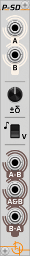

# Polyphonic Same and Different (P-SD)

*Part of the set of [not-things VCV Rack](../README.md) modules.*

## Module operation

The P-SD module accepts two polyphonic input signals (A and B) and analyzes the voltages on their channels. It determines which voltages appear in both of the inputs and which appear in only one of them. Based on this analysis, the P-SD module generates three output signals:

* **A-B**: Voltages that appear only in the A input.  
* **A&B**: Voltages that appear in both A and B inputs.  
* **B-A**: Voltages that appear only in the B input.  

## Comparison tolerance (±δ)

When comparing input channels, P-SD considers two voltages equal if their difference is within a certain range. This range is set using the ***Delta Tolerance*** knob (labeled '**±δ**'), adjustable from 0 to 1 volts. Setting a *Delta Tolerance* allows signals to be compared even if they contain slight variations or "wobble" in their values.

> **Note:** Even when the *Delta Tolerance* is set to 0V, P-SD still applies a minimal tolerance of 0.00001V to account for minor inaccuracies inherent in voltage processing.

## Voltage vs note mode (v / ♪)

A toggle switch on P-SD allows selection between *Voltage mode* (labeled '**v**') and *Note mode* (labeled '**♪**').

* **Voltage mode:** Processes incoming voltages as they are.  
* **Note mode:** Interprets voltages as 1V/oct musical notes, ignoring octave information. The signals are rescaled to a range of 0–1V before comparison, but they are *not* quantized to the nearest note (i.e. only octave information is removed).

> Example:
>
> **Given the following inputs**
>
> * Input A contains 1.0V (=C5), 0.417V (=F4), -2.0V (=C2) and -0.417V (=G3)
> * Input B contains 0.0V (=C4), 0.583V (=G4), 1.333V (=E5) and 0.020V (=C4 + a quarter of a semitone)
>
> **In note mode**
>
> * 1.0V, -2.0V and 0.0V will be treated as the same value (a C)
> * -0.417V and 0.583V will be treaded as the same value (a G)
> * 0.417V will be a distinct value (the only F)
> * 1.333V will be a distinct value (the only E)
> * 0.020V will be a distinct value (it's near to a C, but will not be quantized)
>
> **In voltage mode**
>
> * All values are considered distinct values

## Handling of duplicate values

If the input signals contain multiple occurrences of the same value, the default behaviour of P-SD is to not include those duplicate values on the outputs. For this purpose, PS-D checks for duplicates taking the active *Delta tolerance* into account: as voltage channels are added to the different outputs, the voltage will not be added to the output if it already contains another voltage that is within the active tolerance range.

The '**Output Duplicate Voltages**' option (available in the right-click menu) allows this behavior to be changed:

* **Disabled (default):** Outputs do not contain duplicate values.  
* **Enabled:**  
  * ***A-B** & **B-A** outputs*: Contain all values from their respective inputs that were not present in the other input.  
  * ***A&B** output*: Contains all values from both A and B inputs that matched, up to 16 channels. Results in inherent duplicates since both the matching value from A and B will be added.

> Example:
>
> If Input A contains [ 1.00V, 1.02V, 4.00V ], Input B contains [ 4.00V ] and *Delta tolerance* is 0.05V:
>
> * 1.00V and 1.02V fall within the tolerance range. In default duplicate handling mode, only 1.00V will be included on *A-B*
> * 4.00V appears in both the inputs. In default duplicate handling mode, the *A&B* output outputs a single 4.00V value. If *Output duplicate voltages* is enabled, 4.00V will appear twice.
