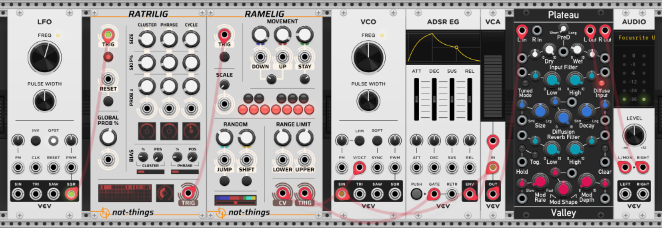
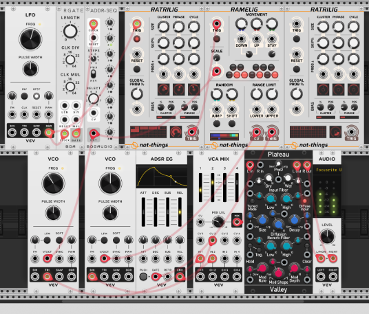
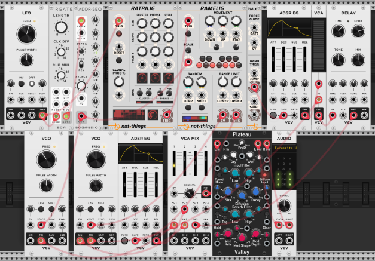

# RAMELIG and RATRILIG Samples

*Part of the set of [not-things VCV Rack](../README.md) modules.*

Below are links to and descriptions of some simple patches containing Ratrilig and Ramelig to demonstrate some of their basic behavior

## Basic Ratrilig into Ramelig

The [Basic Ratrilig into Ramelig](./ralig/ramelig-ratrilig-basic.vcv) patch contains a very basic setup:

* A VCV LFO provides a constant clock signal (4 beats per second)
* The clock signal is sent into Ratrilig to generate a trigger pattern. All Ratrilig parameters are at their default values
* The output of Ratrilig is patched into the trigger input of Ramelig to let it generate note sequences. All Ramelig parameters are at their default values
* The output of Ramelig is used to let a VCV VCO-ADSR-VCA combination play the generated note and rhythm sequence
* The plateau reverb adds some color to the sound before sending it to the Audio output module

## Ratrilig into Ramelig with chords

The [Ratrilig into Ramelig with chords](./ralig/ramelig-ratrilig-with-chords.vcv) patch builds upon the basic patch by:

* Setting up a Bogaudio ADDR-SEQ with a 4-chord progression: C, E, A and F. This sequence is advanced using the LFO clock, but with a 16x clock divider in between.
* The chord progression is played on a second VCO, which is set one octave lower
* The chord progression is also sent into the Ramelig scale CV (which is set to Chromatic 1V/Oct mode in the right-click menu). The stored scales in Ramelig are set up to only play the notes of the active chord
* On Ratrilig, the gates per cluster have been reduced to 4 and all Skip chance values have been reduced (and disabled for the cycle)
* On Ramelig, the lower and upper range limit has been increased by one octave (i.e. 1V)
* Since two voices need to be mixed together (the chord root notes and the melody line), the VCV VCA is replaced with the VCV Mixer module

## Simple RM-X expander usage

The [Ratrilig into Ramelig with RM-X expander](./ralig/ramelig-ratrilig-with-rmx.vcv) patch continues from the *Ratrilig into Ramelig with chords* patch, and adds a simple usage of the Ramelig expander (RM-X):

* The RM-X module is added to the right of Ramelig
* The **JUMP** trigger output is connected to a new VCV ADSR module
* The ADSR Envelope output drives a VCV VCA, which is connected to the Triangle output of the melody VCO
* The resulting notes are sent into a VCV Delay module
* The **WET** output of the delay module is mixed in with the rest of the patch audio.

The result is that any time a *Jump* action is performed by Ramelig, the resulting note will be repeated by the delay module, using the Triangle sound instead of the Sine output (i.e. a bit more present in the mix).
