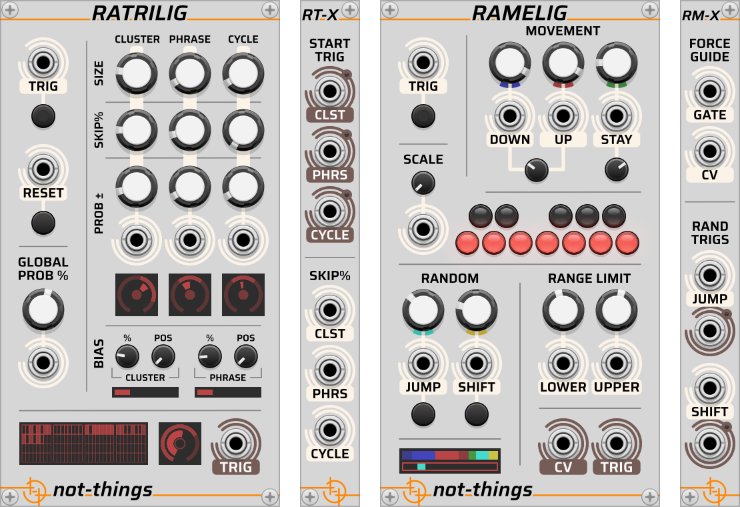

# RAMELIG and RATRILIG

*Part of the set of [not-things VCV Rack](../README.md) modules.*

Ramelig and Ratrilig are a set of modules that are designed to "improvise" melodic lines. Both modules accept a trigger signal on their input and use a combination of randomness and parameterized control to generate an output signal:

* Ramelig is a "Random Melody Line Generator": it generates a CV (pitch) output, producing a new note for each received trigger and creating melodic motion between notes.
* Ratrilig is a "Random Trigger Line Generator": it generates a trigger/gate output by allowing the received trigger to either pass through or not based on configurable probability parameters, resulting in a variable trigger sequence.

While both modules can be used separately, Ratrilig can be used to drive Ramelig by patching its trigger output into Ramelig’s trigger input. This results in melodic sequences where both rhythm (trigger timing) and pitch movement are probabilistically controlled.

More information about each of the modules and their expanders can be found at:

* [Ramelig](./RAMELIG.md)
* [Ratrilig](./RATRILIG.md)
