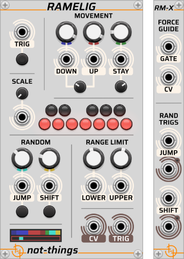
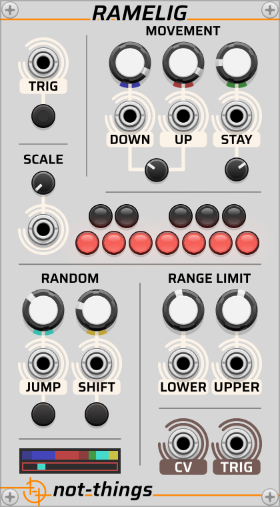
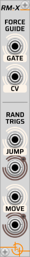

# RAMELIG

*Part of the [Ramelig and Ratrilig](./RALIG.md) set of [not-things VCV Rack](../README.md) modules.*

## Table of contents

* [Melodic concept](#melodic-concept) behind Ramelig
* [Ramelig main](#main-module) module
  * [Trigger input section](#trigger-input-section)
  * [Scale section](#scale-section)
  * [Movement section](#movement-section)
  * [Random section](#random-section)
  * [Range Limit section](#range-limit-section)
  * [Output section](#output-section)
  * [Visualization section](#visualization-section)
* [Polyphony](#polyphony)
* [Ramelig expander](#expander-module) module
  * [Force guide](#force-guide)
  * [Random triggers](#random-triggers)

## Melodic concept

The melodic concept behind the Ramelig module is that notes in a melodic line are usually more structured than purely randomly generated note sequences. A melodic line typically moves stepwise (one or two notes up or down) or repeats a note. Occasionally, the melody will make a bigger jump, after which it will either return toward the original note, or the sequence will shift to the new note position, establishing a new tonal center.

The way Ramelig applies this concept is that it keeps track of (or 'remembers') the previously generated note. Each time an input trigger is received, a weighted randomization algorithm selects an action to be performed:

* move down: step down by one or two scale notes
* move up: step up by one or two scale notes
* stay: repeat the current note
* jump: move to a different random note but return towards the previous note on the next trigger
* shift: move to a different random note and continue from that new position on the next trigger

The *Movement* and *Random* controls determine how Ramelig decides which action to perform when a trigger is received. The controls assign a value between 0 and 10 to each of the actions. These values are not percentages, but relative likelihood factors between the different actions. For example, if:

* the *move up* action has a value of 5,
* the *move down* action has a value of 5,
* the *jump* action has a value of 2.5,
* the *stay* action has a value of 10 and
* the *shift* action has a value of 0

Then the *move up* and *move down* actions are equally likely to be the next action to be performed. The *jump* action is half as likely to be picked compared to the *move up* and *move down* actions, and the *stay* action is twice as likely to be picked compared to the *move up* and *move down* actions, and four times as likely compared to the *jump* action. The 0 value of the *shift* action means that it will not be picked.

All actions (*move down*, *move up*, *stay*, *jump*, and *shift*) are part of a single weighted selection process.

In practice, Ramelig behaves like a memory-based random walker, where each step is chosen from a set of musical actions (move down, move up, stay, jump and shift), each with their own relative likelihood.

## Main module

The controls on Ramelig are grouped in several sections:

* A *Trigger* section that receives the input trigger/gate
* A *Movement* section that controls the likelihood of the move up, move down, and stay actions being selected, with movement occurring by one or two steps
* A *Scale* section that specifies the scale in which notes will be generated
* A *Random* section that controls the likelihood that the jump and shift actions are performed
* A *Range Limit* section that controls the pitch range in which notes are generated
* A *Visualization* section that gives visual feedback of the module operation
* An *Output* section that produces the output signal of the module

### Trigger input section

The **TRIG** input section at the top left of Ramelig contains both a CV input control and a button. The CV input expects a trigger/gate signal. Each time a trigger is received (i.e. the input CV rises from below 1V to 1V or higher), or if the trigger button is clicked, Ramelig will generate a new note on its output based on the current settings of the other Ramelig controls.

Any changes on the other Ramelig controls (either through moving the dials or by a changing input CV) will not have any impact on the current output and will only take effect when the next input trigger is received.

### Scale section

The output pitch generated by Ramelig will always follow the scale that is specified in the **SCALE** section. A 12-LED keyboard-like control provides a way to select the allowed notes. Using the **SCALE** dial, a total of 12 different user-defined scales can be configured. The 12-LED keyboard-like control will always display and edit the active scale.

An input port allows the active scale to be changed using an input CV. Through the *Scale CV mode* in the right-click menu, the way that this input influences the active scale can be selected:

* *Decimal (0V-10V)*: The 12 scales will be divided equally over the 0 to 10 volt range. The resulting scale index will be added to the current value of the scale dial, moving it up or (in case of a negative voltage) down (with wrap-around).
* *Chromatic (1V/Oct)*: The input voltage will be interpreted as a note pitch, allowing the selection of the 12 scales to be done by note index (c = 0, c# = 1, d = 2, d# = 3, etc.). The resulting scale index will be added to the current value of the scale dial (with wrap-around). This allows scenarios like selecting the active scale based on the root note of an active chord.

### Movement section

The controls in the **MOVEMENT** section allow the likelihood of the move *DOWN*, *UP*, and *STAY* actions to be configured (see [melodic concept](#melodic-concept) for details about the types of actions). The *Down*, *Up* and *Stay* actions each have their own knob and CV input port. The knob allows a value between 0 and 10 to be selected and the input CV allows this to be modulated (e.g. 1v = +1, -2v = -2). The resulting value will determine the relative likelihood of the specific action compared to the other possible actions. The likelihood value is limited to the 0-10 range, even if the input CV would cause it to go outside of this range.

The small *Move by one or two steps factor* dial below the **DOWN** and **UP** controls specifies whether a move down or up action is more likely to be by one scale note, or by two scale notes. A larger factor results in a bigger likelihood that the move will be by two steps, a smaller factor means that one step is more likely. At 0, all move up/down actions will be by one step, at 10, all will be by two steps, and at 5 there will be a 50% chance for each.

The *Stay repeat factor* dial (the small dial below the stay action controls) determines how likely it is that the *Stay* repeats multiple times. If the previously selected action was a *Stay* action, the likelihood that the next action will also be a *Stay* action is influenced by this setting. As a formula, this can be expressed as: `repeat_stay_likelihood = stay_likelihood * (stay_repeat_factor / 10)`. So at 5, the likelihood of a repeated *Stay* action will be halved. Setting it to a lower value will reduce its likelihood further (completely disabling a repeated *Stay* action at 0), while moving it higher will reduce the impact of the *Stay repeat factor* (returning it to the original *Stay* likelihood value all the way at 10).

### Random section

The **RANDOM** section contains the controls that specify the likelihood of the *Jump* and *Shift* actions being triggered (see [melodic concept](#melodic-concept) for details about the types of actions). As is the case in the [movement section](#movement-section), each of the actions has a knob that allows a value between 0 and 10 to be selected and an input CV to modulate it. The resulting value will be limited to the 0-10 range, and will specify the relative likelihood of each of the actions.

Both **JUMP** and **SHIFT** have a button below the CV input ports. Clicking on these buttons will *force* the corresponding action to be performed. This *forced* action will not be taken immediately, but instead will be used the next time an action is to be performed due to an incoming trigger (instead of selecting a random action based on the relative likelihood of all actions). If both the **JUMP** and the **SHIFT** buttons have been clicked before a new trigger is received, the *Jump* action takes priority and will be the one to be performed. Once a forced action has been performed, Ramelig will return to its normal algorithm to determine which actions to perform for future triggers.

### Range Limit section

To keep the generated melody lines within a certain pitch range, the **RANGE LIMIT** section allows a **LOWER**- and **UPPER** limit to be set for the notes generated by Ramelig. The dials allow the limit to be set in a 1V/Oct pitch range with input CVs to modulate it. The end result will be limited to a -10V to 10V range.

When a random *Jump* or *Shift* action is performed, the generated random note will be within the lower and upper range specified. If a *Move Down* action was to be performed, but that action would cause the note to go below the lower limit, a *Move Up* action will be performed instead. In the reverse case, if a *Move Up* action would take the note above the upper limit, Ramelig will perform a *Move Down* action instead.

Any changes made (both on the range dials and on the input CV) in between triggers will not be applied to the processing or the output signal of Ramelig until the next trigger causes an action to be performed. This means that changing the **LOWER** or **UPPER** limit will not cause the current voltage (i.e. pitch) on the output port to be limited to the new range immediately. If changes are made to the range in between triggers that cause the last-played note (i.e. the 'remembered' note) to fall outside of the range, a new input trigger will cause Ramelig to first limit this note back into the range before continuing its operation.

### Output section

Ramelig contains two output ports. The main output of Ramelig is the **CV** output port, which sends out the 1V/Oct pitch CV of the current note.

Each time an action is performed by Ramelig, the **TRIG** output port will send out a gate signal with the same length as the gate signal received on the **TRIG** input port. If the action was performed because the **TRIG** button was clicked, a short gate signal will be generated on the **TRIG** output port for it. If the **TRIG** button is clicked while there is also an already active gate signal on the **TRIG** input port, a new action will be triggered by Ramelig, but the resulting gate signal for the button click will overlap with the gate signal from the **TRIG** input port (i.e. not re-trigger).

### Visualization section

The visualization section of Ramelig shows two bars that reflect the state of Ramelig.

A color scheme is used to identify the different actions in the visualization:

* *Blue* for the *Move Down* action with dark blue for a 2-note step and a lighter blue for a 1-note step
* *Red* for the *Move Up* action with dark red for a 2-note step and a lighter red for a 1-note step
* *Green* for the *Stay* action
* *Cyan* for the *Jump* action
* *Yellow* for the *Shift* action

A small color swatch below the dials of each of the actions shows the corresponding color of that action for easy identification of the actions in the visualization.

The top bar shows the current action likelihood distribution. Even though a changed likelihood of the actions only impacts the Ramelig processing once a new trigger input is received, the visualization in the top bar will update immediately when any of the values is changed (dials or input CV).

The bottom bar represents the full range specified by the controls in the [range limit section](#range-limit-section). A small rectangle will show the position of the currently active note within that range, using the color of the last executed action (using the same color scheme). This bar will only update once for each action generated, even if the *Range Limit* is changed in between.

## Polyphony

If Ramelig receives a polyphonic input signal on the *Trig* input port, the module will run in polyphonic mode:

* A polyphonic output signal will be generated on the output ports, with the channel count matching that of the input signal
* Each input channel will be processed independently by Ramelig
* The CV input ports expect either a monophonic or a polyphonic signal:
  * If the CV input signal is monophonic, its voltage will be used for all channels
  * If the CV input signal is polyphonic, each channel uses the corresponding CV channel. If fewer CV channels are present than trigger channels, missing channels default to 0V.
* The visualization section of Ramelig will display the status and processing of the first polyphonic channel.

In essence, when running in polyphonic mode, Ramelig behaves like multiple independent instances running in parallel, one for each channel.

## Expander module

RM-X is an expander module for Ramelig. It expands the functionality of the main module by adding a set of input and output ports. To use it, place it directly to the left or right of a Ramelig main module. If the main Ramelig module is in polyphonic mode due to its **TRIG** input signal, the expander module will operate in the same polyphonic mode.

### Force guide

The *Force guide* inputs allow the note generation of Ramelig to be temporarily overwritten, instead guiding the melody using an external source. This allows scenarios where the random melody generation of Ramelig is combined with other melody sources. This can be used to “anchor” or temporarily override the generated melody, for example to introduce a fixed motif or to follow an external sequence. Or a sequencer can occasionally force Ramelig to hit specific notes at key moments (like returning to the root note at the start of a phrase) while letting it improvise freely the rest of the time.

Any time a trigger is received on the **TRIG** input of the main Ramelig module, if there is a high gate signal (>= 1V) on the *Force Guide* **GATE** input port, instead of generating a new note using the normal action likelihood determination, Ramelig will use the voltage that is supplied on the *Force Guide* **CV** input port as 1V/Oct pitch CV. This input pitch is then constrained by the active *Range Limit* and quantized to the active *Scale* of the Ramelig module. The resulting note will then be used on the **CV** output port and will become the "previous" note from which Ramelig will continue processing the next time an input trigger is received.

### Random triggers

The *Rand Trigs* section of the Ramelig expander module adds additional input and output ports for the **JUMP** and **SHIFT** functionality of the Ramelig module. The input ports complement the buttons of the main module, *forcing* a **JUMP** or **SHIFT** action to be performed when the next input trigger is received if the input signal goes from low to high (i.e. from below 1V to equal or higher than 1V). See the [Random section](#random-section) of the main module for more details about forced random actions.

The **JUMP** and **SHIFT** output ports of the RM-X expander module will send out a short trigger/gate signal each time the corresponding action is performed by Ramelig. This enables patching reactions to specific melodic events, such as triggering accents or modulation whenever a *Jump* or *Shift* occurs.

> **Note 1**: the **JUMP** and **SHIFT** output ports will send out a gate signal any time that action is actually being performed, either because it was the action chosen through the likelihood determination algorithm, or because it was forced to be triggered using the **JUMP** or **SHIFT** buttons or receiving a CV input signal.

> **Note 2**: The output ports will not send out a gate signal immediately when a high gate signal is detected on the RM-X **JUMP** or **SHIFT** input ports or the buttons are clicked. It is only when that action is actually performed by the main Ramelig module upon a new trigger on its main **TRIG** input port that the corresponding output port of RM-X will send out a new gate signal.
