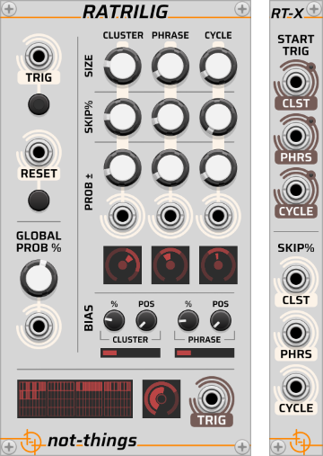
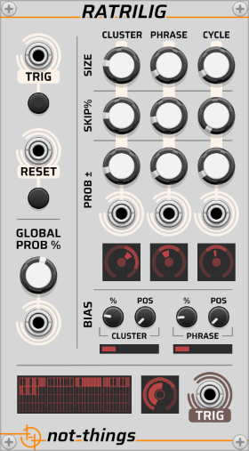
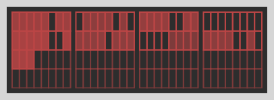
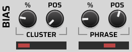
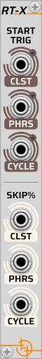

# RATRILIG

*Part of the [Ramelig and Ratrilig](./RALIG.md) set of [not-things VCV Rack](../README.md) modules.*

Ratrilig is a 'Random Trigger Line Generator'. It receives an incoming trigger/gate sequence and decides, for each trigger, whether to pass it through to the output or to suppress it. This decision is based on configurable probability parameters, resulting in a variable trigger sequence.

## Table of contents

* [Rhythmic concept](#rhythmic-concept) behind Ratrilig
* [Ratrilig main](#main-module) module
  * [Input section](#input-section)
  * [Global probability section](#global-probability-section)
  * [Grouping parameters section](#grouping-parameters-section)
  * [Bias section](#bias-section)
  * [Output section](#output-section)
  * [Visualization section](#visualization-section)
* [Polyphony](#polyphony)
* [Ratrilig expander](#expander-module) module
  * [Start triggers](#start-triggers)
  * [Skip CV input](#skip-cv-input)

## Rhythmic concept

The rhythmic concept behind the Ratrilig module is that rhythmic patterns in music are usually not completely random and don't have a uniform density. Instead, there will be parts that are more active, while others contain less activity. Sometimes there will be bursts of notes and at other times there will be sections that are silent. These patterns of activity can exist over multiple overlapping layers with certain phrases having more activity, while still containing clusters of lower activity and other clusters with more activity.

The way Ratrilig applies this concept is by grouping the incoming clock triggers into a three-level hierarchy: *clusters*, *phrases* and *cycles*. At the lowest level, a configurable number of incoming triggers form a cluster. Clusters get grouped into phrases and phrases are grouped into cycles. At each level in this hierarchy, Ratrilig independently determines whether that unit is active or not, and if it is active how much it modifies the base density by increasing or decreasing it.

Each time an input clock trigger is received, Ratrilig has to determine whether it will be passed on to the module output. This determination is based on a probability system with a base density that specifies how likely it is for any input gate to be passed through as an output gate. This base density is then influenced by the three density modifiers of the different hierarchical layers. Each time a cluster, phrase or cycle starts, it gets assigned a random density modifier that will be used for it. The result is that a cycle might end up busier than others, some phrases within it can be sparser compared to the others and the clusters in it will also vary in density.

In addition to the density modifiers, Ratrilig also allows the elements at each of the levels to have a chance to be *skipped* completely. If a certain cluster, phrase or cycle gets skipped, any incoming gate that arrives for it will be suppressed. This means that a single cluster, entire phrase or a full cycle may end up silent.

A *bias* system adds rhythmic anchoring to the system by making certain positions in the hierarchy more active. For example, by letting the first cluster in a phrase always have a higher chance of being active, a sense of a downbeat can be created. Bias can be applied on two levels: a cluster at a specific location in each phrase can be given a positive bias, and a phrase at a specific location in each cycle can be given a positive bias.

Because Ratrilig still uses probability rather than fixed patterns, it will continuously generate different rhythms. However, the combination of a hierarchical structure with multi-level density modifiers, probabilistic skipping, and positional bias provide some structured control over the randomness.

For example, with a cluster size of 4, phrase size of 2, and cycle size of 3, each cycle contains 24 input triggers (4 \* 2 \* 3). Each group of 4 consecutive triggers forms a cluster with its own density modifier, every 2 clusters form a phrase, and 3 phrases complete one cycle. Some clusters or phrases may be skipped entirely, and biasing could make a specific cluster in each phrase more likely to produce output triggers — creating a sense of rhythmic anchoring at regular intervals.

## Main module

The controls on Ratrilig are grouped in several sections:

* An *Input* section for the input clock trigger/gate and a reset action
* A *Global probability* section that specifies the overall gate density
* A *Grouping parameters* section that allows the cluster, phrase and cycle size, skip chance and probability modifier range to be specified
* A *Bias* section that provides controls for the position and value of the cluster and phrase biases
* An *Output* section that produces the output signal of the module
* A *Visualization* section that shows the generated trigger pattern and gives visual feedback of the module operation

Ratrilig works with incoming and outgoing triggers or gates. For brevity, these will be referred to as *triggers* for the rest of this document.

### Input section

The input section at the top left of Ratrilig contains **TRIG** and **RESET** inputs. For both, a CV input port and button control are available. If an input trigger is detected on the CV input (i.e. the input voltage moves from below 1V to 1V or higher), or if the button of the action is clicked, the corresponding action will be performed

The intended usage of Ratrilig is that it receives a steady clock trigger sequence on the **TRIG** input. Ratrilig will then use its internal probability algorithm to determine if that trigger is sent to the module output or not.

The **RESET** action will reset the position of Ratrilig. This means that the next time that a trigger is received on the **TRIG** input, the first cluster of the first phrase in the first cycle will become active, with newly determined skip and density modifier values.

### Global probability section

The controls that define the global probability percentage are located below the input section. The value on the main *Gate Density* dial specifies the "base" percentage of how many of the incoming triggers will be sent to the module output.

The linked *Density CV* input can modulate this value using a -5V to 5V signal: e.g. 2.5V will add 50, -1.25V will remove 25, -5V will reduce the value by 100 and 5V will add 100. The end result (dial value + CV value) will be kept within the 0 to 100 (percent) range.

This global probability will then be modified by the applicable cluster, phrase and cycle probability modifiers.

### Grouping parameters section

The top right section of Ratrilig contains the controls for the different grouping layers within Ratrilig. The *cluster*, *phrase* and *cycle* layers of the grouping hierarchy each have their own column of controls.

#### Size

The **SIZE** dial specifies how many consecutive input triggers are in one cluster, how many clusters are grouped into one phrase, and how many phrases there are in one cycle. A value between 1 and 32 can be specified on each of them.

At the start of each cluster, phrase or cycle, Ratrilig will determine new probability values that apply to that cluster, phrase or cycle. The values that are determined at the start of the hierarchical elements will apply to that element for its full duration. The next two rows specify the range of those probabilities.

#### Skip

The **SKIP%** dials control how likely it is that a cluster, phrase or cycle will be skipped. If any of the active elements in the hierarchy (i.e. the active cluster, phrase and cycle) are skipped, all incoming triggers will be dropped, even if the other active hierarchical elements are not skipped.

#### Prob +/-

The **PROB +/-** dials specify the *probability modifier range* of each of the hierarchical elements. At the start of each cluster, phrase and cycle, a random probability modifier will be generated with a symmetric range around zero, defined by the **PROB +/-** dial. For example, if the dial is set to 15, then the *probability modifier* will be between -15 and +15. This *probability modifier* will be applied on top of the global probability value (see the [Global probability section](#global-probability-section)) as long as that hierarchical element is active (i.e. a negative *probability modifier* will lower the overall probability, a positive will increase it). The probability modifiers of all three active the hierarchical layer elements will be applied at the same time. E.g. if the *global probability* is set to 55%, the determined *cluster* probability modifier is -7.5%, the *phrase* probability modifier is 5.5% and the *cycle* probability modifier is 10%, the resulting probability used by Ratrilig for an incoming trigger will be (55 - 7.5 + 5.5 + 10 =) 63%.

Underneath each of the **PROB +/-** dials, a CV input exists that can be used to modulate the *probability modifier range* values. The scaling of these CV inputs works the same as the *Density CV* described in the [Global probability](#global-probability-section) (i.e. in the -5V to 5V range).

### Bias section

Bias creates rhythmic anchoring, e.g. a sense of a "downbeat" or emphasis at a specific point in the pattern. For example, biasing the first cluster in each phrase means the start of each phrase is more likely to have triggers, creating a sense of a rhythmic pulse.

The bias can be applied to a specific cluster within a phrase, and a specific phrase within a cycle to get an increased gate probability. This will make that cluster or phrase become more present since on average it will have more triggers pass through. This can be used to give certain rhythmic accents or anchoring, such as a downbeat.

The **BIAS %** dial defines how much additional probability the biased cluster or phrase will receive. This bias value will be added on top of the global probability and the probability modifiers of the cluster, phrase and cycles.

The **BIAS POS** dial specifies which cluster in the phrase, or which phrase in the cycle will be biased. The dial uses a value from 0 to 1, with 0 being the first item and 1 being the last. The exact values of the position depend on the number of clusters in the phrase or phrases in the cycle. E.g. if there are 4 clusters in a phrase, then the **BIAS POS** values will be divided as follows:

* 0.00 - 0.24999 is the first cluster
* 0.25 - 0.49999 is the second cluster
* 0.50 - 0.74999 is the third cluster
* 0.75 - 1.00000 is the fourth cluster

If both cluster and phrase bias are active at the same time, applying both on top of each other could result in an over-scaling of the probability (e.g. quickly reaching 100%). To avoid this, Ratrilig will check the two bias values, apply the highest of the two in full, but only apply half of the smaller bias value.

The bias controls overwrite the **SKIP%** chance of the [Grouping parameters](#grouping-parameters-section) section: if a cluster or phrase is biased, it will always play and not become skipped.

To disable biasing of clusters/phrases, set the **BIAS %** to 0. In this case, no bias will be applied, the **BIAS POS** dial has no impact and the **SKIP%** of clusters/phrases will not be overwritten.

### Output section

The Ratrilig output section has a single **TRIG** output port. Any incoming trigger/gate for which the skip and probability algorithm of Ratrilig determined that it should be passed through will be present on the output port. The outgoing trigger/gate will remain high at 10V for as long as the input signal remains high.

### Visualization section

There are several visualizations on Ratrilig that give a view of the internal state of Ratrilig: the state of the grouping parameter section, the current progress within the hierarchical sequence, the probability values that influenced the current output and the position of the bias.

#### Probability modifiers

At the bottom of the grouping parameters section, a circular visualizer gives a view of the state of each of the corresponding hierarchical layers: one for each of the cluster, phrase and cycle. There are three concentric circles that provide the relevant status information. These are:

* Innermost circle: indicates the skip status of cluster/phrase/cycle: an empty circle means it is skipped
* Middle circle: Shows the probability modifier value currently active for this cluster/phrase/cycle (as determined when it started)
* Outer circle: Shows the range current possible probability modifier value, as determined by the **PROB +/-** controls

The outer circle is directly linked to the probability modifier controls: updating the value on the dial or through the CV input will immediately be reflected on the visualization. The middle and inner circle show the values that are currently active in the Ratrilig algorithm. They will only update when new values are generated, i.e. when a new cluster/phrase/cycle starts, and the *skip* and *probability modifier* values for that item are determined again.

The values displayed on the outer and middle circles of the cluster and phrase will also take the bias into account if a bias is currently active for them. In that case, the whole circle will be rotated to the right to display the bias impact.

The four sample probability modifiers displayed above show:

* The first three items are not being skipped (filled-in center circle) while the last one is skipped (empty center circle)
* The first, third and fourth items have no active bias (outer and middle circle are centered around the top of the circle) while the second one has an active bias (outer two circles are rotated to the right)
* The current probability modifier value of the first two items is a positive value (middle circle shows a curve to the right), while the third item has a negative value (middle circle curves to the left). Since the last item is skipped, the probability modifier value is also zero.

#### Sequence progress

The sequence progress visualization is shown at the bottom left of the Ratrilig UI. Every rectangle in the visualization is one incoming trigger. Each row represents a phrase, which has small separators in it to show the cluster grouping. The whole visualization control displays a single cycle.

Each time Ratrilig receives an input trigger and advances a step in the sequence, the corresponding rectangle in the visualization will be updated: either the rectangle will be filled in if a trigger passed through, or an empty rectangle is shown if the trigger was stopped due to either a *skip* being active, or the random probability determined that the trigger should not be passed on.

#### Output probability

The output probability visualization is located next to the **TRIG** output port. It shows the internal variables that resulted in the last input trigger either being passed on or not. Just like the [Probability modifiers visualization](#probability-modifiers), it uses three concentric circles to show the internal state:

* The innermost circle shows if the trigger passed through (a filled-in circle) or if it was stopped either because of an active *Skip* or because of the random probability (an empty circle)
* The middle circle shows the *end probability* that was applied to the trigger. It is a combination of the *global probability*, the *probability modifiers* of the cluster, phrase and cycle, and any active *bias* value.
* The outer circle shows the random value that was generated for the trigger. If the generated value is below the *end probability* (i.e. less than the middle circle), the trigger is allowed to pass through, otherwise it will be blocked.

The three sample output values displayed above show:

1. A trigger that was allowed to pass through (filled-in innermost circle) because the randomly generated value (outermost circle) is below the active *end probability* value (middle circle)
2. A trigger that was not allowed to pass through (empty innermost circle) because the randomly generated value (outermost circle) is above the active *end probability* value (middle circle)
3. A trigger that was not allowed to pass through (empty innermost circle) because either the cluster, phrase or cycle was being skipped. The middle circle still shows the *end probability* value, but because the trigger was already being skipped, no random value was generated for it (outermost circle does not show a value).

#### Bias position

A small bar underneath the cluster and phrase bias controls shows which cluster in the phrase or phrase in the cycle will get a bias applied according to the current positions of the **POS** controls. In the sample above, the first cluster in the phrase will be biased, and the third phrase in the cycle.

## Polyphony

If Ratrilig receives a polyphonic input signal on the **TRIG** input port, the module will run in polyphonic mode:

* A polyphonic output signal will be generated on the output port, with the channel count matching that of the input signal
* Each input channel will be processed independently by Ratrilig
* The CV input ports expect either a monophonic or a polyphonic signal:
  * If the CV input signal is monophonic, its voltage will be used for all channels
  * If the CV input signal is polyphonic, each channel uses the corresponding CV channel. If fewer CV channels are present than trigger channels, missing channels default to 0V.
* The visualization section of Ratrilig will display the status and processing of the first polyphonic channel.

## Expander module

RT-X is an expander module for Ratrilig. It expands the functionality of the main module by adding a set of input and output ports. To use it, place it directly to the left or right of a Ratrilig main module. If the main Ratrilig module is in polyphonic mode due to its **TRIG** input signal, the expander module will operate in the same polyphonic mode.

### Start triggers

The **START TRIG** output ports will send out an output trigger when a new cluster, phrase or cycle starts. This enables patching reactions to specific moments in the Ratrilig sequence.

### Skip CV input

The **SKIP%** input ports allow an input CV signal to be used to modulate the skip chance of clusters, phrases and cycles. The voltage on these input ports will be combined with the values of the corresponding **SKIP%** dials of the main module in the same way as the *Density CV* described in the [Global probability](#global-probability-section) (i.e. in the -5V to 5V range).
