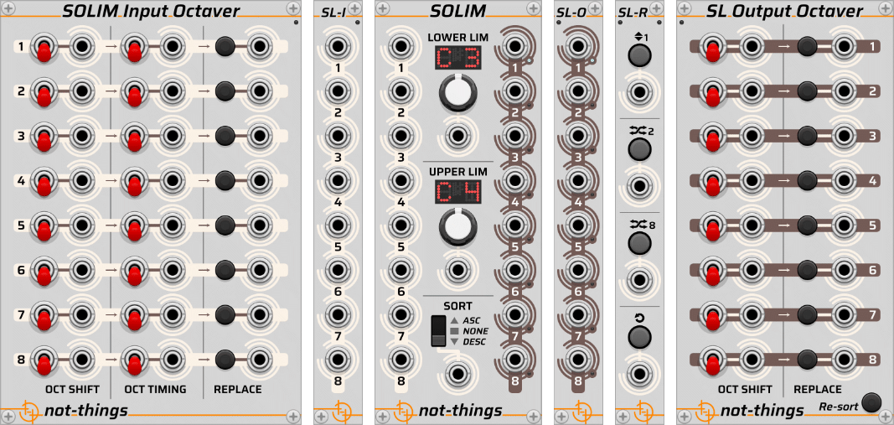
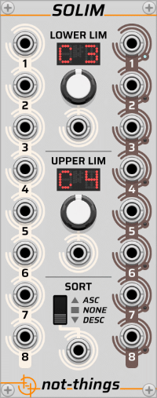
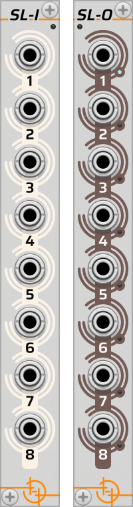
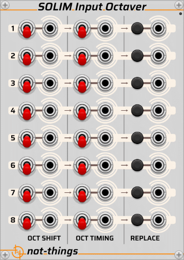
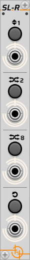

# SOLIM

*Part of the set of [not-things VCV Rack](../README.md) modules.*

The core idea behind this set of modules is to first **lim**it a sequence of input values to a defined range and subsequently **so**rt them. While this would normally result in *Limso* as a name, *Solim* just seemed to sound better.

> **NOTE:** This document provides a detailed description of the Solim modules. While it aims to cover all features comprehensively, the amount of information may be a can much to read in one go. For a concise summary of each module’s functionality, check out the [TL;DR version here](./solim/SOLIMI-tldr.md). You can always return to this page later for deeper insights into how and why specific features behave as they do.
>
> **Tutorial Video:** This patch-from-scratch tutorial includes a demonstration of the core functionality of Solim and its expanders:
> 

The concept of Solim is intended to work on a sequence of input voltages that represent 1V/oct note values. As such the limiting is done by either adding or removing octaves (i.e. 1V) from the incoming voltages until the resulting values are within the specified range. The rest of this documentation will also describe the functionality in this context, although the modular nature of VCV Rack allows it to be used in any other context if its funtionality fits the requirements.

This set of modules contains one main module that can be used by itself or in a chain with one or more expander modules that extend the functionality of the main module.

* [Main](#solim-main-module) module
* [SL-I and SL-O](#sl-i-and-sl-o-solim-input-and-output-expanders), the Solim Input and Solim Output expanders
* [Solim Input Octaver](#solim-input-octaver-expander) expander
* [Solim Output Octaver](#solim-output-octaver-expander) expander
* [SL-R](#sl-r-solim-random-expander), the Solim Random expander

> **Sidenote**: *The core idea behind the Solim module is to work with chord progressions and leverage chord inversions for smooth transitions between chords. By limiting note values to a an octave range and sorting them (resulting in chord inversions), the module minimizes abrupt note movement during chord changes. This approach ensures seamless transitions in chord-based pads or arpeggiated sequences, with minimal note movement required. Expander modules allow further modifications to the resulting chord notes, adding flexibility and creativity. Of course, this is just the starting concept for the Solim set of modules. Being modular, I'm sure they can be used in all sorts of unexpected and creative ways.*

### Parameter Controls vs CV Inputs

On the Solim main module and expanders, the different settings that configure how Solim processes the input voltages all have both a parameter control (a knob, switch or button) and an input CV port to control the setting using voltages coming from other modules. As a general rule, when a cable is connected to the input CV port, the parameter control will no longer influence the setting. The voltage coming into the input CV will instead take full control of the relevant setting.

## Solim (Main module)

This module provides the core Solim functionality. It takes up to eight input voltages, limits them according to the values set for *Lower Lim* and *Upper Lim* and sorts them according to the selected *Sort* mode. The limiting is done by adding or subtracting 1V (i.e. shifting by octaves) from the voltage until it falls within the specified range. In practice, this means that the note doesn't change (e.g. a C remains a C, and an E remains an E, etc.), only the octave adjusted.

Solim does not quantize voltages during processing. While the limiting values are displayed on the module as quantized note values for ease of use, the limiting process itself only works on octave (i.e. 1V) ranges and does not quantize the values to specific scales or exact note voltages.

### Inputs

There are eight input ports on the left side of the module. Only connected inputs will be taken into account by Solim, so it is possible to leave "gaps" in the inputs. Unconnected inputs will be ignored for processing (i.e. they will **not** be included during processing as if they had a 0V input signal).

If only one input is connected and the incoming signal is polyphonic, the different channels (up to 8) of the polyphonic signal will be used as if they were connected to the different inputs of Solim. If two or more inputs are connected, all inputs will be treated as monophonic inputs, and only the first channel of polyphonic inputs will be used.

### Outputs

There are eight output ports on the right side of the module. These outputs contain the processed (limited and/or sorted) result voltages. By default, the outputs of Solim are always monophonic, even if the input to Solim was polyphonic. The outputs are populated from top to bottom without leaving gaps, even if there were gaps in the input connections.

In the right-click menu, there is an option to make the Solim output polyphonic. When active, the first output port will become polyphonic, and receive the (up to) eight output values across its polyphonic channels. The other output ports will become inactive, all outputting 0V.

A small green LED next to each output port lights up when Solim sends a signal to it. When Solim is used as a standalone module, the number of active output ports matches the number of input signals. When combined with octaver expander modules, output values can be added to or removed from the sequence during processing, resulting in more or fewer active output signals. If the addition of values to the sequence results in more than 8 output voltages, Solim will assign the first 8 output voltages of the final processing result to the output ports.

### Limiting controls

The middle section of Solim contains two sets of limiting controls: the *Lower Lim*it and the *Upper Lim*it.

The note values for each limit are displayed on a LED display, rounding down to the nearest note. Each limit value can be set using the knob below the display. The knob ranges from -5 (V/oct) to 5 (V/oct) with the middle position being 0 (V/oct) or C4.

Below each knob is a CV input for that limit. The incoming voltage is constrained to the -5V to 5V range by Solim, so it is not possible to exceed that range using a CV input. If the CV input port is connected, the incoming voltage will replace any current value set on the limit knob.

When processing values, Solim first applies the lower limit and then the upper limit. Note that if the lower and upper limits are less than 1V apart, or if the upper limit is below the lower limit, this can result in output values below the requested lower limit since the upper limiting is applied last.

### Sorting control

At the bottom of the middle section, the sorting that will be applied after limiting the input values can be set.
With the switch in the middle position, no sorting is applied. In the top position, the result values are sorted in ascending order before being sent to the output ports. In the bottom position, they are sorted in descending order.

A sorting CV input is available below the sorting switch. A 0V CV input means no sorting is applied. A positive CV value results in an ascending sort order and a negative CV value results in a descending sort order. If the CV input port is connected, the incoming voltage will replace any current value set on the sorting switch.

### Expander chaining

Several expanders can modify or extend Solim's functionality. A flexible, variable-length chain of Solim modules can be formed depending on the desired functionality, but certain rules govern how expanders can be chained:

* Input modules (*SL-I* and *Input Octaver*) must always be placed on the left side of the main Solim module.
* Output modules (*SL-O* and *Output Octaver*) must always be placed on the right side of the main Solim module.
* Solim supports chaining up to 7 *SL-I* and *SL-O* expanders. Adding more input or output expanders will break the chain.
* Only one *Input Octaver* and one *Output Octaver* can be added to the chain. Adding more instances of these expanders will break the chain.
* The *SL-R* module can be placed either to the left or right of the main Solim module. Only one *SL-R* can be placed in a direction; a second instance will break the chain.
* Any module that is not a Solim expander module will break the chain.

All expander modules have a small LED at the top of the panel that turns green when correctly connected to a Solim chain.

### Performance considerations

By default, Solim processes at the current VCV Rack audio sample rate (44100 times per second at 44.1kHz, 48000 times per second at 48kHz, etc.). However, in most scenarios, the values Solim processes (e.g. the notes of a chord in a chord progression) do not change that frequently, so Solim does not need to check for changes at the audio sample rate.

In the right-click menu of the main Solim module, there is a *Process at audio rate* option that can be turned on or off. If turned off, Solim instead checks and processes values approximately 6000 times per second (i.e. 6 times per millisecond), significantly reducing CPU usage.

## SL-I and SL-O (Solim Input and Output expanders)

### Expander chaining

The SL-I expander must always be placed to the left side of the main Solim module, while the SL-O expander must always be placed to the right side. If an SL-I expander is placed on the right side of a Solim module, or an SL-O on the left side, the expander will not be connected to the main Solim module, and the chain of expanders for that main module will also stop here.

One main Solim module can have up to 7 SL-I expanders and up to 7 SL-O expanders connected. Any more SL-I or SL-O expanders will not be connected to the main Solim module, and the chain of expanders for that main module will also stop on that expander module.

The SL-I module has a small LED on the top right of the panel that turns green when it is connected with a main Solim module on its right side or red if it is not connected. The SL-O module has a similar LED on the top left of its panel, indicating a connection to a main Solim module on the left side.

### Functionality

The SL-I and SL-O expander modules don't add additional input and output values to the existing eight inputs and outputs of the main Solim module but instead behave as if there is a second main Solim module added to the patch, with (up to) 8 input values being processed independently from the other SL-I/SL-O expanders and from the inputs and outputs of the main Solim module.

The input ports of the SL-I operate in the same way as described in the input section of the [Main](#solim-main-module) module (e.g. input gaps polyphony handling, etc.). Because the inputs of different SL-I modules and the main Solim module are processed separately, each set of inputs can have a different number of input voltages connected and it is possible to have one receive a single polyphonic input (from which the different channels will be used as input values), another receive several consecutive monophonic inputs, and yet another have gaps within the input connections.

The output ports of the SL-O operate in the same way as described in the output section of the [Main](#solim-main-module) module. Just like the main module, each SL-O module can be set to either monophonic or polyphonic output in its right-click menu.

### SL-I and SL-O pairing

When multiple SL-I and SL-O expander modules are connected to a main Solim module, the expander modules will be connected from closest to the main Solim module to furthest as indicated in the image below.

If there is an unequal number of SL-I and SL-O expanders, Solim will only process the input voltages of SL-I expanders that can be paired with a matching SL-O expander.

### Parameter Controls and CV Inputs

When one or more SL-I and SL-O expanders are connected to a main Solim module, any parameter controls on the main Solim module (lower and upper limit knobs, sort switch) or on other expanders will apply to all SL-I input and SL-O output values. If one of those parameters, however, has a CV input connected, the way that this CV input is processed will depend on the type of input:

* If the input is monophonic, it will apply to all SL-I and SL-O (and main Solim) values.
* If the input is polyphonic, the different channels will be applied to the different expanders and the main Solim module, where the main Solim module will receive the value of the first polyphonic channel, and the connected SL-I and SL-O expanders will receive the second, third, etc. polyphonic channels in the order going outwards from the main Solim module (as is also defined under [SL-I and SL-O pairing](#sl-i-and-sl-o-pairing)).
* If the input is polyphonic, but there are fewer polyphonic channels than there are SL-I/SL-O expanders, the channels will still be divided over the expanders going from the main Solim module outwards, but those expanders for which no channel exists in the polyphonic input CV signal will instead receive the value of the last channel of the polyphonic input. Example: if there are 4 SL-I and SL-O expanders connected, and the CV input is a polyphonic signal with 3 channels, the main Solim module will receive channel 1, the first SL-I and SL-O will receive channel 2, the second will receive channel 3, and the remaining expanders 3 and 4 will also receive channel 3.

## Solim Input Octaver expander

### Expander chaining

The Solim Input Octaver expander must always be placed on the left side of the main Solim module. It is allowed to place it in between other connected SL-I modules, or at the end of a chain of SL-I modules.

Only one Solim Input Octaver expander is allowed per main Solim module. A second Solim Input Octaver will not be connected to the main Solim module, and the chain of expanders for that main module will also stop there.

The Solim Input Octaver module has a small LED on the top right of the panel that turns green when it is connected with a main Solim module on its right side or red if it is not connected.

### Functionality

The Solim Input Octaver allows an additional action to be performed **after** limiting has been applied to the input values of the main Solim module (or SL-I expanders).

The module contains eight rows of controls, one for each of the Solim voltage input ports.

Using the *Oct Shift* switch, it is possible to add or remove an octave (i.e. 1V) **after** limiting. With the switch in the upward position, an octave will be added. In the downward position, it will be moved an octave lower. In the middle position, no action will be performed on that input voltage.

If sorting is active on the Solim module, the octaving of the values can have an impact on the sort order, so the *Oct Timing* switch specifies when the octave should be applied. In the downward position, the octaving is done **before** the sort (so the octaving will influence the sort order). In the upward position, the octaving is done **after** the sort (so the sort will be done on the original value, and octaving will not impact the sort order).

The final *Replace* button specifies if the octaved value should replace the original value, or if both the original value and the octaved value should become part of the value sequence. With the button pressed down (and the LED lit), the octaved value will replace the original value. With the button not pressed down (and the LED not lit), the original value will remain in place, and the octaved value is added to the **end** of the list of input voltages. If the *Oct Shift* switch is in the middle position (i.e. no octaving of that input value is to be done), a pressed *Replace* button will result in the original value being removed, but no octaved value will be added in its place, effectively removing that input value from the sequence.

### CV inputs

Each of the parameter controls of the Input Octave Expander has a CV input next to it. If a signal is connected to a CV input, its input voltage will take over control of that parameter:

* For an *Oct Shift* input, a positive voltage will correspond with adding an octave, a negative voltage with removing an octave, and 0V with taking no octaving action.
* For an *Oct Timing* input, a positive voltage corresponds with performing the octave shift after sorting, while 0 or a negative voltage corresponds with performing the octave shift before sorting.
* For a *Replace* input, a positive voltage activates replace/removing the original value, while 0 or a negative voltage keeps the original voltage and adds the octaved value to the end of the sequence.

When one or more SL-I and SL-O modules are connected, any CV input is handled according to the polyphonic rules that are described in the [Parameter Controls and CV Inputs](#parameter-controls-and-cv-inputs) section of the SL-I/SL-O description.

## SL-R (Solim Random expander)

### Expander Chaining

The SL-R expander module can be placed on either the left or right side of the main Solim module. It is also possible to place an SL-R module on both sides of the main Solim module without breaking the expander chain. This will result however in only the left SL-R module will being considered active for that Solim module. The SL-R expander can be positioned anywhere in between other connected input or output expanders, or at the end of a chain of connected expanders.

It is not permitted to place two SL-R expander modules on the same side of a main Solim module. If this occurs, the second SL-R module will not connect to the main Solim module, and the expander chain for that main module will terminate on the second SL-R module.

An SL-R module can also be shared between two Solim modules by being placed on the left of one and the right of the other. In this setup, both Solim modules will respond to randomization triggers from the shared SL-R module.

The SL-R module includes small LEDs on the top left and right of the panel. These LEDs light up green when the module is connected to a main Solim module on that side, or remain dim if no connection is detected on that side.

### Functionality

The SL-R expander module allows the order of the output values of a Solim (or SL-O expander) module to be randomized. This randomization occurs after limiting and sorting, but before any processing by a connected [Output Octaver](#solim-output-octaver-expander) expander.

The randomizer will always operate on the active output ports, identified by their lit LEDs. There are four randomization actions that can be performed by this expander. From top to bottom, these are:

* Move One: Selects a randomactive output and swaps its position with the output directly above or below it (the direction is chosen randomly). If the selected output is the first or last active output, wrap-around behaviour ensures the swap can be completed.
* Switch Two: Moves a randomly chosen active output to a different position, effectively swapping the positions of two randomly picked active outputs.
* Randomize 8/All: randomizes the order of all active outputs.
* Reset: Restores all active outputs to their original positions.

If the number of output values changes over time (e.g., due to connected input ports being added or removed, or changes made by the Input Octaver expander), the current randomization order is preserved. Newly added outputs are appended to the end of the sequence, while removed outputs leave the remaining ones in their relative positions.

If an active SL-R module is removed from the Solim expander chain, any randomized outputs will revert to their original order.

The randomization order is not persisted when saving a VCV Rack patch. When reopening thee patch, all outputs will return to their default order.

> Note: When an SL-R expander is used together with an Output Octaver expander, the [Resort](#resort) function of the Output Octaver can override any randomization applied. This happens because resorting occurs after randomization. If you add randomization to your value sequence but don’t see any effect, check whether an Output Octaver expander is present with Resort enabled as it may be reordering the values after they were randomized.

### CV inputs

Each randomization action button has a corresponding CV input for triggering it. A voltage trigger of at least 1V is required to activate an action. Unlike other Solim modules, the buttons on the SL-R remain functional even when CV inputs are connected.

When one or more SL-I and SL-O modules are connected, CV inputs follow the polyphonic rules outlined in the [Parameter Controls and CV Inputs](#parameter-controls-and-cv-inputs) section of the SL-I/SL-O description. Clicking the SL-R module buttons while SL-I/SL-O modules are connected will trigger the corresponding randomization action across all outputs.

## Solim Output Octaver expander

### Expander chaining

The Solim Output Octaver expander must always be placed to the right of the main Solim module. It can be positioned between other connected SL-O modules or at the end of an SL-O chain.

Only one Solim Output Octaver expander is allowed per main Solim module. A second instance will not connect to the module, and the expander chain will terminate at the second unit.

The Solim Output Octaver features a small LED at the top left of its panel. This LED turns green when the module is connected to a Solim module on its left or red if no connection is detected.

### Functionality

The Solim Output Octaver operates on the output sequence after all prior processing is complete, including input octaving, limiting, sorting, and randomization. It features the same controls as described for the [Solim Input Octaver](#solim-input-octaver-expander), except that it does not have *Oct Timing* controls since it operates after the sorting of the main Solim module. However, it does includes its own additional sorting control (see [Output Sorting](#output-sorting) and [Resort](#resort)).

The eight rows on the Solim Output Octaver expander correspond to the (up to) eight output values produced by processing in the previous modules. If actions in the Output Octaver create additional values (e.g., by adding octaved values) or remove existing values (using the *Replace* control), the newly formed sequence will not undergo further processing by the Output Octaver. For example, if there are four output values and the Output Octaver duplicates the second value one octave higher, the final output will consist of five values, but the fifth value will not be processed by the module's fifth column.

### Output Sorting

Since the output values are already sorted prior to the Output Octaver, the octaving process tries to ensure that the final sequence aligns logically with the main Solim module's active sorting mode:

* **Ascending or No Sorting** on the main module: Values shifted one octave lower are added first, followed by the original sequence values that are not replaced due to the *Replace* parameter, and then the values shifted one octave higher.
* **Descending** on the main module: Values shifted one octave higher are added first, followed by the original sequence values that are not replaced due to the *Replace* parameter, and then the values shifted one octave lower.

In both cases, processing stops once a maximum of eight output values is reached. Additional values are discarded.

### Resort

If the default sorting from [Output Sorting](#output-sorting) does not produce the desired order, the *Re-sort* button can be activated. When pressed, the final sequence (of up to eight values) is reordered according to the active sort order set on the main Solim module.

By default, resorting applies to all values in the sequence (i.e. all outputs with their LED turned on). However, in the right-click menu of the Output Octaver module, there is an option to *Sort only connected ports*. When this option is enabled, only the values of ports with an active cable connection will be resorted and reassigned to those ports. Ports without a connection will retain their original values and remain unchanged.

> Note: if the main Solim module does not have sorting enabled, the *Resort* of the Output Octaver expander will also apply no additional sorting.

## Full Solim flow

With the full set of Solim modules, there are a number of steps that can be active depending on which expander modules are used and on certain certain values set on those modules. The order in which those steps get executed in the overall flow can influence the end result on the output ports. The flow diagram below shows which steps are performed in which order by the different (expander) modules.

The diagram also shows arrows between the different steps. Although Solim accepts ***up to*** 8 inputs voltages and outputs ***up to*** 8 output voltages, the internal processing by Solim can turn into ***up to*** 16 voltages due to the duplication that can be performed with the *Input Octaver* expander. The diagram below shows this transition from 8 to 16 voltages, and the transition from 16 back to 8 voltages by using only the first 8 voltages after the (optional) randomization has been applied.

Note that although the *Output Octaver* expander also allows duplication of voltages, the internal processing of Solim remains in ***up to*** 8 voltages mode at this point. Once a count of 8 voltages has been reached, the remaining output octaving operations that would introduce additional voltages are ignored, and the next "*Re-sorting*" step is performed using only those first 8 voltages.
