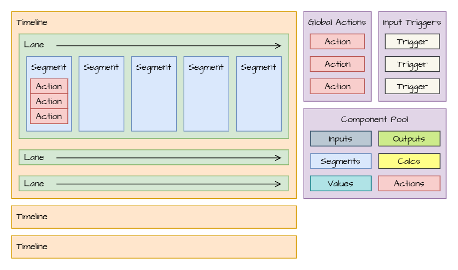

# TIMESEQ JSON SCRIPT
*Part of the set of [not-things VCV Rack](../README.md) modules.*

## Intro
- Processing in script order
- Triggers collected during run, become active on next cycle
- Variables immediately available after set
- terms: number, unsigned number, float number

## Overview

From a high-level view, a TimeSeq JSON script contains:
* One or more *Timeline*s. Each *Timeline* can contain a *TimeScale*, which affects how time is calculated within that timeline
* A *Timeline* contains one or more *Lane*s
* A *Lane* can loop or repeat, and may list the IDs of *Trigger*s that start, restart or stop it. A *Lane* can also be configured to auto-start
* Each *Lane* contains one or more *Segment*s
* A *Segment* has a *Duration* (in samples, milliseconds, beats/bars or hertz) and contains a list of *Action*s
* An *Action* can: 
    * Execute at the start or end of the segment or at the end,
    * Glide between a start and end value over the duration of the segment, transitioning smoothly over the duration of the segment,
    * Or generate a gate: outputting 10V during the first part of the segment and 0V in the second part.
* A *Script* can contain a list of *Global Actions*, which are executed when the script starts or resets (e.g. to initialize output polyphony)
* *Input Triggers* define which input ports (and channels) should produce a *Trigger* when transitioning from low to high voltage
* The *Component Pool* allows reusable definitions of objects to be created that can be referenced throughout the script. This avoids duplicating identical objects and can help with structuring complex script through the use of meaningful IDs.

## Referencing
- circular references
- segments duration and timeline time-scale
- all ports set to 1 channel, all ports and channels set to 0V on start/load/reset