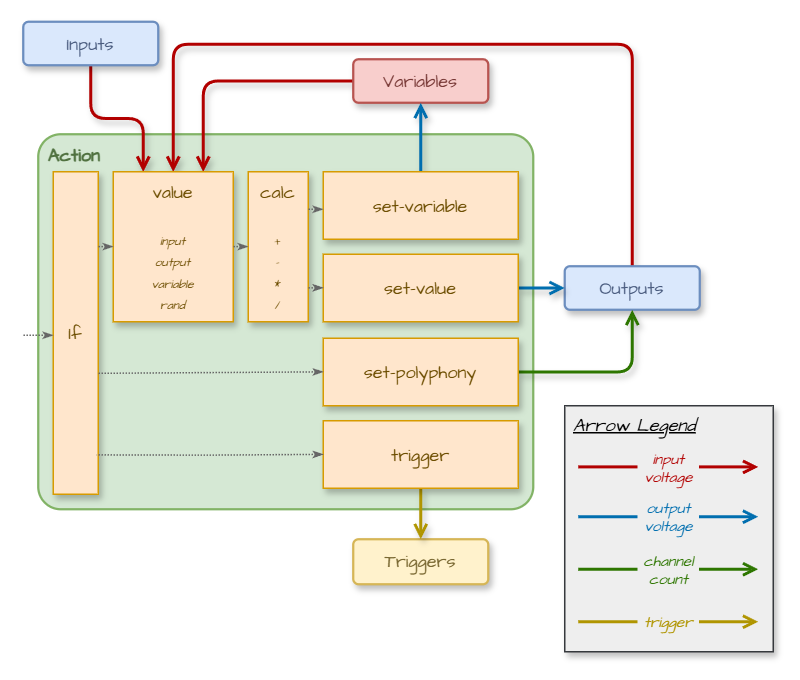

# TIMESEQ SCRIPT
*An overview of the JSON script for the not-things [TimeSeq](TIMESEQ.md) module.*

## Intro
This page describes the concepts used in the TimeSeq script. It introduces the different object types that are used in the script and how they interact with each other, but does not give a detailed description of all properties of these objects. For a full detailed description of all the objects, see the [Script JSON Reference](TIMESEQ-SCRIPT-JSON.md) page.

For running the script, TimeSeq is tied to the active sample rate of VCV Rack. Each sample in VCV Rack will result in a processing cycle in TimeSeq (e.g. when set to 44.1Khz sample rate, there will be 44100 processing cycles per second in TimeSeq). During each such processing cycle, TimeSeq will check if any action should be performed for the running script. Since the TimeSeq processing is tied to the sample rate, the internal processor timing is also based on samples, with all other timing indication that the script provides being translated into the corresponding sample count.

When it comes to the order of processing, a single processing cycle will execute all logic in the order that they appear in the script. The only exception is the execution of *action*s, where the `timing` of an action can have an influence on the processing order (see [action](TIMESEQ-SCRIPT-JSON.md#action) in the Script JSON Reference for more details).

## High Level Overview


From a high-level sequencing view, a TimeSeq script contains:
* One or more *timeline*s. Each *timeline* can contain a *time-scale*, which affects how time is calculated within that *timeline*.
* A *timeline* contains one or more *lane*s.
* A *lane* can loop or repeat, and may list the IDs of *trigger*s that start, restart or stop it. A *Lane* can also be configured to auto-start when the script is loaded.
* Each *Lane* contains one or more *Segment*s.
* A *Segment* has a *Duration* (in samples, milliseconds, beats/bars or hertz) and contains a list of *Action*s.
* An *Action* can:
    * Execute at the start or end of the *segment*,
    * Glide between a start and end value over the duration of the *segment*, transitioning smoothly over the duration of that *segment* or
    * Generate a gate: outputting 10V during the first part of the *segment* and 0V in the second part.

A script can also contain following items at the root level:
* A list of *global-actions*, which are executed when the script starts or resets (e.g. to initialize output polyphony)
* *input-triggers* that define which input ports (and channels) should produce an internal *trigger* when transitioning from low to high voltage (see [triggers](#triggers))
* A *component-pool* that contains reusable definitions of objects that can be referenced throughout the script. This avoids having to declare identical objects in multiple places in a script and can help with structuring more complex scripts through the use of meaningful IDs (see [referencing](#referencing))

## Actions
The *action* level of the TimeSeq script contains the functional part of the sequencer. It's where the actual interaction- and processing logic occurs. Depending on the `timing` property, three types of *action*s can be distinguished:
* One-time actions (either at the `start` or the `end` of a *segment*)
* Glide actions (that `glide` from one value to another for the whole duration of a *segment*)
* Gate actions (that output a `gate` for the duration of a *segment*)

### One-time actions


One-time actions are executed either at the start or at the end of a *segment*. In both cases, they follow the same execution logic:
* Actions can have an optional `if` condition. Actions will only be executed if the `if` condition evaluates to `true` (or if there is no `if` condition on the action).
* Each action contains exactly one operation that it can execute. This can be either a `set-variable`, a `set-value`, a `set-polyphony` or a `trigger`:
    * A `set-variable` operation will set a variable (identified by its `name`) to a specific voltage. This variable can then be used by other actions and conditions. The voltage to use for the variable is determined by a *value*, which optionally has *calc*ulations applied to it (add, subtract, multiply or divide with another *value*). The voltage of a *value* is retrieved from either:
        * An *input* port
        * A previously assigned variable
        * An *output* port
        * A *rand*om voltage generator
    * A `set-value` operation will change the voltage on an *output* port. The voltage that is assigned to the *output* port is determined in the same way that the *value* of a `set-variable` operation is determined.
    * A `set-polyphony` operation will change the number of channels on an *output* port, making it polyphonic (when setting it between `2` and `16` channels) or monophonic (when setting it to `1` channel).
    * A `trigger` operation will fire an internal trigger (see [triggers](#triggers)).

### Glide actions
Just like one-time actions, a glide action has an optional condition. If this condition does not evaluate to `true`, the glide action will not be executed.
Also like one-time actions, glide actions can set the voltage of either a variable or an *output* port. Unlike one-time actions however, glide actions don't just set one voltage *value*. Instead, a `start` *value* and an `end` *value* are defined, and the glide action will gradually move from the start *value* to the end *value* for the duration of the *segment*. By default, the glide action will move linearly between the two *value*s, but an optional easing factor allows the action to change faster in the beginning and ease out towards the end, or start moving slowly at the start and speed up towards the end.

### Gate actions
A gate action allows a gate signal to be generated on an *output* port. It will change the *output* port voltage to 10v at the start of a *segment*, and change it to 0v as the *segment* progresses. By default, the change to 0v will occur halfway through the duration of the *segment*, but it is possible to change this position using the `gate-high-ratio`, moving it more towards the start of the *segment* or more towards the end of the *segment*.

## Triggers
The TimeSeq core processor contains support for internal triggers. Internal triggers are always referenced by their `id` (as choosen by the user).

Internal triggers can either be fired by a trigger *action* that is executed when a *segment* starts or ends, or because an external trigger or gate signal was detected on an input port that was monitored by an *input-trigger*.

All internal triggers that get fired as part of a TimeSeq processing cycle of TimeSeq will be collected in a list. At the start of the next processing cycle, this list of collected triggers can then influence the running status of *lane*s: a *lane* can specify the ID of triggers that cause a status change of the *lane* if that trigger is fired:
* The `start-trigger` identifies the trigger ID that will cause the *lane* to start if it is not running yet
* The `restart-trigger` identifies the trigger ID that will cause the *lane* to start if it is not running yet, or restart if it is already running.
* The `stop-trigger` identifies the trigger ID that will cause the *lane* to stop if it is running.

Once the states of the *lane*s has been updated, the triggers will be cleared and the processing of actions can fire new triggers, which can then influence the *lane* running states at the start of the next processing cycle.

This trigger mechanism can be used for multiple purposes. Sequences can be started or stopped based on input signals from other modules in a patch. Different sequences within the same script can be chained by placing them in different *lane*s/*timeline*s and letting them interact with each other through triggers. More complex logical setups can also be created by combining conditional actions and triggers, resulting in more application-like functionality.

## Referencing
The [component-pool](TIMESEQ-SCRIPT-JSON.md#component-pool) allows JSON objects to be defined which are not directly placed into the sequences of a script, but can instead be referenced from other parts of the scripts. This allows a single definition of an object to be re-used in multiple places in the script (avoiding the need to duplicate the same object multiple times in different places) and can help in bringing structure in more complex scripts.

The *component-pool* allows re-usable instances to be defined for *segment*s, *segment-block*s, *action*s, *value*s, *calc*s, *input*s and *output*s. Next to the regular supported properties for each of these types, an additional `id` property is required if they are added to the *component-pool*. This `id` must be unique per object type, but two objects of different types are allowed to use the same `id`. E.g. there can be only one *segment* with the `id` **me-myself-and-id**, but it is allowed for a *segment* and a *value* to both have that `id`.

Any component that has been defined in the *component-pool* can be used in other places in the TimeSeq script by using the `ref` property name and the `id` of the component in the place where you would normally write the full copmonent definition inline.

### Example
In the following JSON action, the value of channel 9 on output port 6 is set to the current voltage of channel 2 on input port 4:
```json
{
    "value": {
        "input": {
            "index": 4,
            "channel": 2
        }
    },
    "output": {
        "index": 6,
        "channel": 9
    }
}
```

Since *value*s, *input*s and *output*s can be defined in the *component-pool*, it's possible to define re-usable components for these:
```json
{
    "component-pool": {
        "values": [
            {
                "id": "value-4.2",
                "input": { "ref": "input-4.2" }
            }
        ],
        "inputs": [
            {
                "id": "input-4.2",
                "index": 4,
                "channel": 2
            }
        ],
        "outputs": [
            {
                "id": "output-6.9",
                "index": 6,
                "channel": 2
            }
        ]
    }
}
```
This definition already shows the first usage of a reference: the *value* doesn't define the full *input* object anymore inline, but instead references the newly defined `input-4.2` *input* object by using a `ref` towards it.

Using the same `ref` mechanism, the original action JSON can now be written as:
```json
{
    "value": { "ref": "value-4.2" },
    "output": { "ref": "output-6.9" }
}
```

### Circular References
Due to the hierarchical structure of the TimeSeq script, it is possible to create a setup where a circular reference occurs. For example, if an *action* uses a *value* by reference with id `my-first-value`, and that value has a *calc* property that tries to add a *value* to it, again by using reference `my-first-value`, a circular reference will appear on that `my-first-value` *value* id. These kinds of references can occur several levels deep with multiple objects in between, but will always result in a reference loop that can not be resolved. TimeSeq will detect these kinds of references when a script is loaded and treat this as an error.

### Segment References and Duration
If a *segment* is used by reference by `id` in multiple *timeline*s, the duration of that segment can be different in each *timeline* dependant on the *time-scale* of the *timeline*. E.g. if one *timeline* specifies a `bpm` of 120 in its *time-scale*, and the other a `bpm` of 90, then a *segment* that has a duration of 4 `beats` will have a different duration (in milliseconds/beats) when placed in those two *timeline*s.

