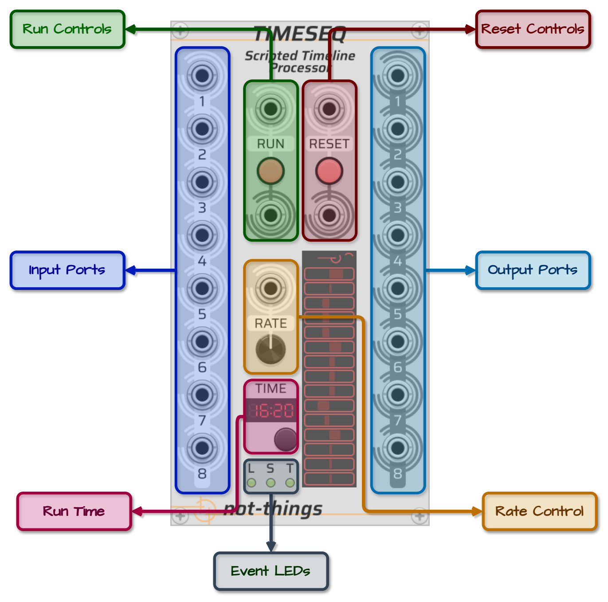
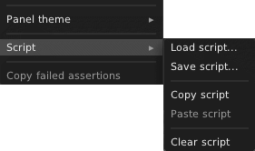

# TIMESEQ UI PANEL
*An overview of the UI for the not-things [TimeSeq](TIMESEQ.md) module.*

## Table of Contents
* [TimeSeq Controls](#timeseq-controls)
* [Script Loading](#script-loading)
* [Status Display](#status-display)
* [Rate Control](#rate-control)
* [Asserts](#asserts)

## TimeSeq Controls

The TimeSeq panel has following controls:
* **Run Controls**:
    * *Input Port*: If a script is currently loaded but not running, a trigger on the input port will start/continue the script. If the script is currently running, the script will be paused. If no valid script is loaded, this input will have no impact.
	* *LED Button*: The LED will light up when the button is pressed or if a trigger is received on the Run input port. Clicking the button will have the same impact as a trigger on the Run input port: if a script is running, it will be paused. If a script is stopped or paused, it will started/will continue.
	* *Output Port*: A trigger signal is sent on the output port any time the run state of the script is changed.
* **Reset Controls**:
	* *Input Port*: If a script is loaded, a trigger on the input port will cause the progress of the script to be reset and any variables and triggers to be removed. After a reset, a script will be in the same state as if it was just loaded. If the script was running before the reset was triggered, the script will keep running after the reset.
	* *LED Button*: The LED will light up when the button is pressed or if a trigger is recevied on the Reset input port. Clicking the button will have the same impact as a trigger on the Reset input port.
	* *Output Port*: A trigger signal is sent on the output port any time the script is reset.
* **Input Ports**: Eight polyphonic input ports that can be used by the script to receive external voltages.
* **Output Ports**: Eight polyphonic output ports that can be controlled by the script. When a script is loaded or reset, all output ports will be set to monophonic (i.e. have 1 channel), and all outputs are set to 0v.
* **Rate control**: The rate control allows the active script to be processed at a faster or slower then realtime rate. The rate dial can be set to a value from -10 to 10. If a cable is connected to the Rate input port, the input signal will overwrite the currently assigned value of the Rate dial. In this case, the voltage on the input port (rounded down) will be used as rate value. See [Rate Control](#rate-control) for more details about how it influences script processing.
* **Run Time**: The time display shows how long a script has been running in minutes and seconds. The display will wrap every hour. Time will not advance when a script is paused, and changing the [rate](#rate-control) of TimeSeq will also influence the observed time. The button below the Time display will reset the observed time (but will not influence the running state or position of the loaded script).
* **Event LEDs**: Three event LEDs at the bottom of TimeSeq will fire when certain events occur during the execution of a script:
    * The ***L*** LED will light up if a *lane* loops
	* The ***S*** LED will light up if a *segment* starts
	* The ***T*** LED will light up if an internal *trigger* was fired

## Script Loading
The loading of a TimeSeq script is done through the right-click menu of the module.

In the `Script` sub-menu, there are options to:
* **Load script** from a file
* **Save script** (that is currently loaded) to a file
* **Copy script** (that is currently loaded) to the clipboard
* **Paste script** from the clipboard
* **Clear script** to remove the current script from TimeSeq

Any script that is loaded or pasted will first be valiated. See [Script Errors](TIMESEQ-SCRIPT.md#script-errors) on the *TimeSeq Script* page for more details about error handling.

The **Paste** option allows for faster edit-paste-and-test iterations when working on a script when compared to going through a save-load-and-test flow.

## Status Display
The status display that can be found in the lower section of TimeSeq will provide running information from the core script processor. The top line will show the status of the processor:
* ***EMPTY*** if no script is loaded
* ***ERROR*** if a script was loaded that contains errors (and no other script was already loaded before)
* ***PAUSED*** if a script is loaded but it is paused
* A simple ***animation*** if a script is loaded and running
* ***ASSERT*** if an [assert](#Asserts) was triggered by the current script.

Below this, some visual feedback about output voltages is given. Each line can show the output voltage of a channel on an output port. Each time a voltage is changed on an output channel, that channel is added to the display (starting from the bottom) as a voltage line between -10v and 10v (with 0v in the middle). Updated output channels are added to the display in the order that they are updated. If a channel that has its output updated is already present on the display, it's voltage display is updated in the on the line that it currently occupies. The display of an output port voltage will gradually fade out if no [set-value](TIMESEQ-SCRIPT-JSON.md#set-value) action is executed. After a while, output ports that haven't had a *set-value* action executed will be removed from the display as they are considered inactive.

## Rate Control

## Asserts