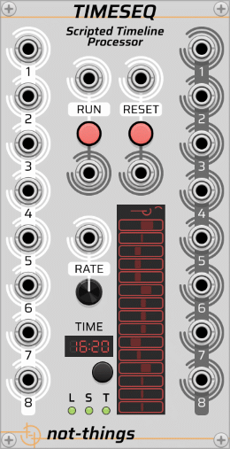

# TIMESEQ
*Part of the set of [not-things VCV Rack](../README.md) modules.*

TimeSeq is a sequencing module whose behaviour is defined by a user-supplied JSON script. At its core is a processor that is capable of executing multiple sequences in parallel, each with individual time-based segmentation.

Scripts can make use of conditional logic, variables, internal triggers and mathematical operations, enabling a wide range of behaviours: from simple note sequences and clock signals to complex logic processing that responds to input voltages received through the module's eight polyphonic inputs. The sequence output voltages can be sent to the eight output ports. With scriptable control over their polyphony, each port can output up to 16 individually addressable polyphonic channels.

The documentation is organized into the following sections:
* [UI Panel](TIMESEQ-UI-PANEL.md): Overview of the controls on the TimeSeq panel and how they relate to script execution.
* [Script Overview](TIMESEQ-SCRIPT.md): Conceptual introduction to the JSON script that drives TimeSeq.
* [Script JSON Reference](TIMESEQ-SCRIPT-JSON.md): Technical reference detailing the structure and elements of the TimeSeq JSON script.
* [Script Samples](TIMESEQ-SCRIPT-SAMPLES.md): A collection of script examples (including VCV Rack patches) illustrating different scripting techniques and some possible use cases.
