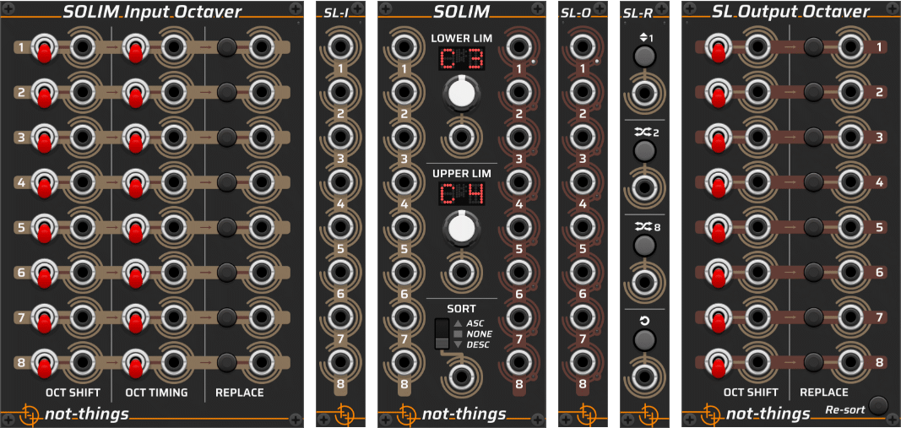

# SOLIM - the TL;DR version

*For the full description, check [here](../SOLIM.md)*.

## Main Solim module

The main solim module accepts (up to) eight inputs on the left ports, and sends (up to) eight outputs to the right ports. The incoming voltages will be adjusted to fit within the range of the specified lower and upper limits. If the input value falls outside this range, octaves (i.e. 1V) will be added or removed from the value until it falls within the range. No quantizing will be done on the voltages to make them match notes or scales.

After applying the limiting, the resulting voltages can be sorted by setting the sort switch to the desired sort order.

CV inputs are available for all three parameters to allow them to be controlled externally.

> All of the expander modules described below have small LEDs in their upper left and/or right corners to indicate if they are currently connected to a main Solim module.

## SL-I (Solim Input) and SL-O (Solim Output) expanders

The SL-I and SL-O expanders add additional inputs and outputs to the main module. An SL-I module must always be placed to the left of the main module. An SL-O must be placed to the right. Up to seven SL-I/SL-O combinations can be added to one main Solim module. SL-I and SL-O modules are paired starting from the main Solim module moving outwards.

Each additional SL-I/SL-O pair is processed by the main Solim module as if it was a separate dedicated Solim module, i.e. the input voltages are not added to the voltages of the main module but are processed as a distinct set of (up to) eight input voltages.

## Solim Input Octaver expander

The Solim Input Octaver must be placed on the left side of a main Solim module. Only one Input Octaver expander can be added per main Solim module.

The operations that are set on this expander will be performed **after** input voltage limiting has been done by the main Solim module. Each of the rows on the Solim Input Octaver corresponds with one of the inputs on the main Solim module or on an SL-I expander.

On each row, the *Oct Shift* switch will either add one octave to the voltage (switch in upward position), remove one octave from the voltage (switch in the downward position), or keep the voltage as-is (switch in the middle position). The *Oct Timing* switch will define when the octave shift will be performed: **before** the main Solim module sorts the values if the switch is in the downward position, or **after** the sorting if the switch is in the upward position. The *Replace* button will specify if the octave-shifted value will replace the original value (if the button is pressed), or if the original value will remain and the octave-shifted value is added to the end of the current sequence of values (if the button is not pressed).

Due to the *Replace* functionality, the Solim Input Octaver can add additional entries to the sequence of values when compared with the original input value set.

All parameters have a corresponding input CV to control them externally.

## SL-R (Solim Random) expander

The SL-R expander can be placed to either side of the main Solim module, but only one SL-R expander can be active on a main Solim module.

The Solim Random expander operates on the result voltages after they have been limited and/or sorted. From top to bottom, there are four possible actions that can be triggered by either clicking the button, or sending a trigger to its trigger input:

* Move one of the active outputs either one position up or one position down,
* Move one of the active outputs to a random position, swapping places with the other active output that is in that place,
* Move all of the active outputs to a random position,
* Restore all of the output positions, removing previously applied randomness.

## Solim Output Octaver expander

The Solim Output Octaver expander must be placed to the right side of the main Solim module. Only one such expander can be added per main Solim module.

The Solim Output Octaver operates on the eight output voltages that result from all other processing (i.e. after the random expander is finished if one is present). It allows the same *Oct Shift* and *Replace* functionality to be performed that is also described in the [Solim Input Octaver expander](#solim-input-octaver-expander) section.

If the order of the results from the Output Octaver Expander is not as desired, the *Re-sort* button can be activated. This will cause the same sorting as is currently active on the main Solim module to be re-applied to the (up to) eight result voltages.
