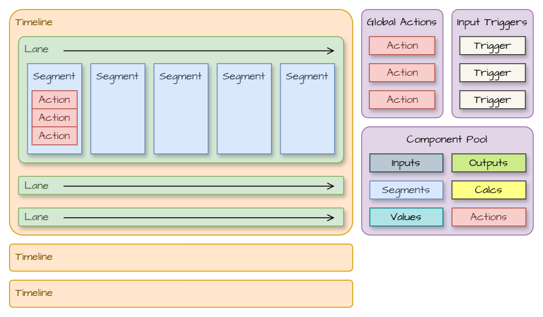
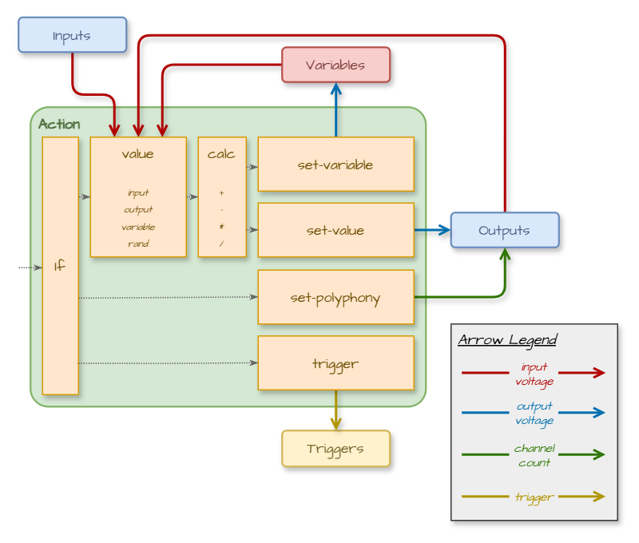

# TIMESEQ SCRIPT

*An overview of the JSON script for the not-things [TimeSeq](../TIMESEQ.md) module.*

## Table of Contents

* [Intro](#intro)
* [High Level Overview](#high-level-overview)
* [Actions](#actions)
  * [One-time Actions](#one-time-actions)
  * [Glide Actions](#glide-actions)
  * [Gate Actions](#gate-actions)
* [Triggers](#triggers)
* [Referencing](#referencing)
  * [Example](#example)
  * [Circular References](#circular-references)
  * [Segment References and Duration](#segment-references-and-duration)
* [Script Errors](#script-errors)
* [Documenting Scripts](#documenting-scripts)

## Intro

This page describes the concepts used in the TimeSeq script. It introduces the different object types that are used in the script and how they interact with each other. It does not go into every detail on all the properties. For a full detailed description of all the objects, see the [Script JSON Reference](TIMESEQ-SCRIPT-JSON.md) page. When looking for an hierarchical overview of the script structure, the Table of Contents on that page is also structured to represent that hierarchy. When a new JSON object type is introduced on this page, it will also link to it's section within the full details on the JSON Reference page.

For running the script, TimeSeq is tied to the active sample rate of VCV Rack. Each sample in VCV Rack will result in a processing cycle in TimeSeq (e.g. when set to 44.1Khz sample rate, there will be 44100 processing cycles per second in TimeSeq). During each such processing cycle, TimeSeq will check if any action should be performed for the running script. Since the TimeSeq processing is tied to the sample rate, the internal processor timing is also based on samples, with all other timing specification that can be used in the script being translated into the corresponding sample count.

Because the execution of a script is tied to the active sample rate, TimeSeq will have to reload a script if the VCV Rack sample rate is changed. When TimeSeq detects a sample rate change, it will automatically reload the current script and reset and pause it.

When it comes to the order of processing, a single processing cycle in TimeSeq will execute all logic in the order that they appear in the script. The only exception is the execution of *action*s, where the `timing` of an action can have an influence on the processing order within the *segment* (see [action](TIMESEQ-SCRIPT-JSON.md#action) in the Script JSON Reference for more details).

## High Level Overview



From a high-level sequencing view, a TimeSeq script contains:

* One or more [timeline](TIMESEQ-SCRIPT-JSON.md#timeline)s. Each *timeline* can contain a [time-scale](TIMESEQ-SCRIPT-JSON.md#time-scale), which specifies how time is calculated within that *timeline*.
* A *timeline* contains one or more [lane](TIMESEQ-SCRIPT-JSON.md#lane)s.
* A *lane* can loop or repeat, and may list the IDs of *trigger*s that start, restart or stop it. A *Lane* can also be configured to auto-start when the script is loaded.
* Each *Lane* contains one or more [segment](TIMESEQ-SCRIPT-JSON.md#segment)s.
* A *segment* has a [duration](TIMESEQ-SCRIPT-JSON.md#duration) (in samples, milliseconds, beats/bars or hertz) and contains a list of [action](TIMESEQ-SCRIPT-JSON.md#action)s.
* An *action* can:
  * Execute at the start or end of the *segment*,
  * Glide between a start and end *value* over the duration of the *segment*, transitioning smoothly over the duration of that *segment*,
  * Generate a gate: outputting 10V during the first part of the *segment* and 0V in the second part.

A script can also contain following items at the root level:

* A list of *global-actions*, which are executed when the script is loaded or resets (e.g. to initialize output polyphony)
* [input-trigger](TIMESEQ-SCRIPT-JSON.md#input-trigger)s that define which input ports (and channels) should produce an internal *trigger* when transitioning from low to high voltage (see [triggers](#triggers))
* A [component-pool](TIMESEQ-SCRIPT-JSON.md#component-pool) that contains reusable definitions of objects that can be referenced throughout the script. This avoids having to declare identical objects in multiple places in a script and can help with structuring more complex scripts through the use of meaningful IDs (see [referencing](#referencing))

## Actions

The *action* level of the TimeSeq script contains the functional part of the sequencer. It's where the actual interaction- and processing logic occurs. Depending on the `timing` property, three types of *action*s can be distinguished:

* One-time actions (either at the `start` or the `end` of a *segment*)
* Glide actions (that `glide` from one value to another for the whole duration of a *segment*)
* Gate actions (that output a `gate` for the duration of a *segment*)

### One-time Actions



One-time actions are executed either at the start or at the end of a *segment*. In both cases, they follow the same execution logic:

* Actions can have an optional [if](TIMESEQ-SCRIPT-JSON.md#if) condition. Actions will only be executed if the `if` condition evaluates to `true` (or if there is no `if` condition set on the action).
* Each action contains exactly one operation that it can execute. This can be either a `set-variable`, a `set-value`, a `set-polyphony`, `set-label` or a `trigger`:
  * A [set-variable](TIMESEQ-SCRIPT-JSON.md#set-variable) operation will set a variable (identified by its `name`) to a specific voltage. This variable can then be used by other actions and conditions. The voltage to use for the variable is determined by a [value](TIMESEQ-SCRIPT-JSON.md#value), which optionally has [calc](TIMESEQ-SCRIPT-JSON.md#calc)ulations applied to it (add, subtract, multiply or divide with another *value*). The voltage of a *value* is retrieved from either:
    * An [input](TIMESEQ-SCRIPT-JSON.md#input) port
    * A previously assigned variable
    * An [output](TIMESEQ-SCRIPT-JSON.md#output) port
    * A [rand](TIMESEQ-SCRIPT-JSON.md#rand)om voltage generator
  * A [set-value](TIMESEQ-SCRIPT-JSON.md#set-value) operation will change the voltage on an *output* port. The voltage that is assigned to the *output* port is determined in the same way that the *value* of a `set-variable` operation is determined.
  * A [set-polyphony](TIMESEQ-SCRIPT-JSON.md#set-polyphony) operation will change the number of channels on an *output* port, making it polyphonic (when setting it between `2` and `16` channels) or monophonic (when setting it to `1` channel).
  * A [set-label](TIMESEQ-SCRIPT-JSON.md#set-label) operation will set the tooltip label of an *output* port.
  * A `trigger` operation will fire an internal trigger (see [triggers](#triggers)).

### Glide Actions

Just like one-time actions, a glide action has an optional condition. If this condition does not evaluate to `true`, the glide action will not be executed.
Also like one-time actions, glide actions can set the voltage of either a variable or an *output* port. Unlike one-time actions however, glide actions don't just set one voltage *value*. Instead, a `start` *value* and an `end` *value* are defined, and the glide action will gradually move from the start *value* to the end *value* for the duration of the *segment*. By default, the glide action will move linearly between the two *value*s, but an optional easing factor allows the action to change faster in the beginning and ease out towards the end, or start moving slowly at the start and speed up towards the end.

### Gate Actions

A gate action allows a gate signal to be generated on an *output* port. It will change the *output* port voltage to 10v at the start of a *segment*, and change it to 0v as the *segment* progresses. By default, the change to 0v will occur halfway through the duration of the *segment*, but it is possible to change this position using the `gate-high-ratio`, moving it more towards the start or the end of the *segment*.

## Triggers

The TimeSeq core processor contains support for internal triggers. Internal triggers are always referenced by their `id` (as chosen by the user).

Internal triggers can either be fired by a trigger *action* that is executed when a *segment* starts or ends, or because an external trigger or gate signal is detected on an input port that is monitored by an *input-trigger*.

All internal triggers that get fired as part of a TimeSeq processing cycle will be collected in a list. At the start of the next processing cycle, this list of collected triggers can then influence the running status of *lane*s: a *lane* can specify the IDs of triggers that cause a status change of the *lane* if that trigger is fired:

* The `start-trigger` identifies the trigger ID that will cause the *lane* to start if it is not running yet
* The `restart-trigger` identifies the trigger ID that will cause the *lane* to start if it is not running yet, or restart if it is already running.
* The `stop-trigger` identifies the trigger ID that will cause the *lane* to stop if it is running.

Once the states of the *lane*s have been updated, the triggers will be cleared and the processing of actions can fire new triggers, which can then influence the *lane* running states at the start of the next processing cycle.

This trigger mechanism can be used for multiple purposes:

* Sequences can be started or stopped based on input signals from other modules in a patch.
* Different sequences within the same script can be chained by placing them in different *lane*s/*timeline*s and letting them interact with each other through triggers.
* More complex logical setups can be created by combining conditional actions and triggers, resulting in more application-like functionality.
* ...

## Referencing

The [component-pool](TIMESEQ-SCRIPT-JSON.md#component-pool) allows JSON objects to be defined which are not directly placed into the sequences of a script, but can instead be referenced from other parts of the scripts. This allows a single definition of an object to be re-used in multiple places in the script (avoiding the need to duplicate the same object multiple times in different places) and can help in bringing structure in more complex scripts.

The *component-pool* allows re-usable instances to be defined for *segment*s, *segment-block*s, *action*s, *if*s, *value*s, *calc*s, *input*s and *output*s. Next to the regular supported properties for each of these types, an additional `id` property is required to be set on each object that is added to the *component-pool*. This `id` must be unique per object type, but two objects of different types are allowed to use the same `id`. E.g. there can be only one *segment* with the `id` "**me-myself-and-id**", but it is allowed for a *segment* and a *value* to both have the `id` "**me-myself-and-id**".

Any component that has been defined in the *component-pool* can then be used in other places in the TimeSeq script by using the `ref` property name and the `id` as value in the place where you would normally write the full object definition inline.

### Example

In the following JSON action, the value of channel 9 on output port 6 is set to the current voltage of channel 2 on input port 4:

```json
{
    "value": {
        "input": {
            "index": 4,
            "channel": 2
        }
    },
    "output": {
        "index": 6,
        "channel": 9
    }
}
```

Since *value*s, *input*s and *output*s can be defined in the *component-pool*, it's possible to define re-usable components for these:

```json
{
    "component-pool": {
        "values": [
            {
                "id": "value-4.2",
                "input": { "ref": "input-4.2" }
            }
        ],
        "inputs": [
            {
                "id": "input-4.2",
                "index": 4,
                "channel": 2
            }
        ],
        "outputs": [
            {
                "id": "output-6.9",
                "index": 6,
                "channel": 2
            }
        ]
    }
}
```

This definition already shows the first usage of a reference: the *value* doesn't define the full *input* object anymore inline, but instead references the newly defined `input-4.2` *input* object by using a `ref` towards it.

Using the same `ref` mechanism, the original action JSON can now be written as:

```json
{
    "value": { "ref": "value-4.2" },
    "output": { "ref": "output-6.9" }
}
```

### Circular References

Due to the hierarchical structure of the TimeSeq script, it is possible to create a setup where a circular reference occurs. For example in following script snipplet:

```json
{
    "component-pool": {
        "values": [
            {
                "id": "my-first-value",
                "value": {
                    "input": 2,
                    "calc": [
                        {
                            "add": { "ref": "my-first-value" }
                        }
                    ]
                }
            }
        ]
    }
}
```

the *value* with id `my-first-value` takes the current voltage of *input* port 2 and then adds another *value* to it. In this `add` *calc* operation, it tries to use the `my-first-value` again by reference, resulting in a circular reference. This specific circular reference is only one level deep, but circular references can occur several levels deep with multiple objects in between. They will however always result in a reference loop that can not be resolved. TimeSeq will detect these kinds of circular references when a script is loaded and treat this as an error.

### Segment References and Duration

If a *segment* is used by `id` reference in multiple *timeline*s, the duration of that segment can be different in each *timeline* dependent on the *time-scale* of the *timeline*. E.g. if one *timeline* specifies a `bpm` of 120 in its *time-scale*, and the other a `bpm` of 90, then a *segment* that has a duration of 4 `beats` will have a different duration (in corresponding milliseconds) when placed in those two *timeline*s.

## Script Errors

When loading a script, TimeSeq will validate the script before actually loading it. This validation is done in three phases:

1. First a basic JSON validation is done. If the supplied data is not valid JSON, an error message will be provided that details what issue was encountered.
2. If the basic JSON validation succeeded, TimeSeq will perform a script syntax validation against the TimeSeq JSON schema format (as detailed on the [Script JSON Reference](TIMESEQ-SCRIPT-JSON.md) page).
3. If the script syntax validation succeeded, the script is prepared for usage by the TimeSeq core processor. During this preparation, certain functional errors can be encountered (e.g. a `ref` can not be resolved, a *segment* uses `beats` while the *time-scale* does not specify a `bpm`, ...).

If an error is encountered during any of these phases, loading of the new script will be aborted. If a script was already loaded, TimeSeq will keep that old script loaded. Phases (2) and (3) of the script validation can detect multiple errors in a script. If that is the case, the error message popup will display the information of the first encountered error. The dialog will also give the option to copy the full list of errors to the clipboard so they can be pasted elsewhere (e.g. a text editor) for further investigation.

The error messages try to provide as much relevant information as possible. Errors encountered during validation phase (1) will usually include a location indication with the line and column (=character position in the line) where the error was detected. Errors encountered during validation phases (2) and (3) will have following format:
`<error location> : <error message> [<error code>]`

* `<error location>`: Since these errors are encountered after initial JSON parsing has completed, the error location can be identified using the hierarchical location within the JSON structure. The different levels within the JSON hierarchy will be separated by a `/` and items within a list will be identified by their 0-based index (i.e. the first item has index `0`, the second has index `1`, etc.).
E.g. error location `/timelines/1/lanes/3/segments/2` would indicate that in the second *timeline* of the script, the fourth *lane* has an error in its *third* segment.
* `<error message>`: A description detailing the exact error that was encountered
* `<error code>`: An internal error code that details the type of validation check that resulted in the error.

The JSON schema validation is performed using strict validation: not only known properties with unknown or invalid values are treated as errors, unknown properties will also result in an error duration validation. This avoids a scenario where a typo results in a script not behaving in the expected way. E.g. if the `auto-start` of a *lane* is accidentally mistyped as `auto-stort`, this could go by unnoticed if TimeSeq ignored unknown properties. The script would still be considered valid, but the relevant *lane* would not automatically start. Due to the strict validation, the loading of that script will indicate that there is an unknown property on the *lane*, allowing the typo to be corrected.

## Documenting Scripts

One exception to the strict validation mentioned in [Script Errors](#script-errors) is that TimeSeq will ignore any properties that start with `x-` (e.g. `x-auto-start`). This exception has been introduced to:

* Allow sections of the script to be disabled while writing or testing a script by prefixing properties with `x-` to temporarily make TimeSeq ignore them when loading a script
* Allow descriptions to be added to the script, e.g. if there is a need to add reminders about what the purpose is of certain parts of a more complex script. Using properties like `x-description` or `x-comment` to add descriptive information to sections of the script can help in understanding the flow of a script if it is revisited at a later time.
