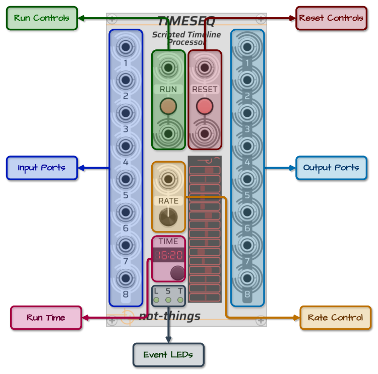

# TIMESEQ UI PANEL

*An overview of the UI for the not-things [TimeSeq](../TIMESEQ.md) module.*

## Table of Contents

* [TimeSeq Controls](#timeseq-controls)
* [Script Loading](#script-loading)
* [Status Display](#status-display)
* [Input Ports and Channels](#input-and-output-ports-and-channels)
* [Rate Control](#rate-control)
* [Asserts](#asserts)

## TimeSeq Controls

The TimeSeq panel has following controls:

* **Run Controls**:
  * *Input Port*: If a script is currently loaded but not running, a trigger on the input port will start/continue the script. If the script is currently running, the script will be paused. If no valid script is loaded, this input will have no impact.
  * *LED Button*: The LED will light up when a script is loaded and running or dim when no script is loaded or it is paused. Clicking the button will have the same impact as a trigger on the Run input port: if a script is running, it will be paused. If a script is stopped or paused, it will started/will continue.
  * *Output Port*: A trigger signal is sent on the output port any time the run state of the script is changed.
* **Reset Controls**:
  * *Input Port*: If a script is loaded, a trigger on the input port will cause the progress of the script to be reset and any variables and internal triggers to be removed. After a reset, a script will be in the same state as if it was just loaded. If the script was running before the reset was triggered, the script will keep running after the reset.
  * *LED Button*: The LED will light up when the button is pressed or if a trigger is received on the Reset input port. Clicking the button will have the same impact as a trigger on the Reset input port.
  * *Output Port*: A trigger signal is sent on the output port any time the script is reset.
* **Input Ports**: Eight polyphonic input ports that can be used by the script to receive external voltages.
* **Output Ports**: Eight polyphonic output ports that can be controlled by the script. When a script is loaded or reset, all output ports will be set to their default state: monophonic (i.e. have 1 channel), and all outputs are set to 0V.
* **Rate control**: The rate controls allow the active script to be processed faster or slower then real-time rate. The rate dial can be set to a value from -10 to 10. If a cable is connected to the Rate input port, the input signal will overwrite the currently assigned value of the Rate dial. In this case, the voltage on the input port (rounded down) will be used as rate value. See [Rate Control](#rate-control) for more details about how it influences script processing.
* **Run Time**: The time display shows how long a script has been running in minutes and seconds. The display will wrap every hour. Time will not advance when a script is paused, and changing the [rate](#rate-control) of TimeSeq will also influence the speed of the time display. The button below the Time display will reset the timer, but will not influence the running state or position in the loaded script.
* **Event LEDs**: Three event LEDs at the bottom of TimeSeq will fire when certain events occur during the execution of a script:
  * The ***L*** LED will light up if a [lane](TIMESEQ-SCRIPT-JSON.md#lane) loops
  * The ***S*** LED will light up if a [segment](TIMESEQ-SCRIPT-JSON.md#segment) starts
  * The ***T*** LED will light up if an internal [trigger](TIMESEQ-SCRIPT.md#triggers) was fired

## Script Loading

The loading of a TimeSeq script is done through the right-click menu of the module.

In the `Script` sub-menu, there are options to:

* **Load script** from a file
* **Save script** (that is currently loaded) to a file
* **Copy script** (that is currently loaded) to the clipboard
* **Paste script** from the clipboard
* **Clear script** to remove the current script from TimeSeq

Any script that is loaded or pasted will first be validated. See [Script Errors](TIMESEQ-SCRIPT.md#script-errors) on the *TimeSeq Script* page for more details about error handling.

The **Paste** option allows for faster edit-paste-and-test iterations when working on a script when compared to going through a save-load-and-test file flow.

## Status Display

The status display that can be found in the lower section of TimeSeq will provide running information from the core script processor. The top line will show the status of the processor:

* ***EMPTY*** if no script is loaded
* ***ERROR*** if a script was loaded that contains errors (and no other script was loaded before)
* ***PAUSED*** if a script is loaded but it is paused
* A simple ***animation*** if a script is loaded and running
* ***ASSERT*** if an [assert](#asserts) was triggered by the current script.

Below this, some visual feedback about output voltages is given. Each line can show the output voltage of a channel on an output port. Each time a voltage is changed on an output channel, that channel is added to the display (starting from the bottom) as a voltage line between -10v and 10v (with 0v in the middle). Updated output channels are added to the display in the order that they are updated. If a channel is already present on the display and its output is updated again, it's voltage display is updated the line that it already occupied. The display of an output port voltage will gradually fade out if no [set-value](TIMESEQ-SCRIPT-JSON.md#set-value) action is executed. After a while, output ports that haven't had a *set-value* action executed will be removed from the display as they are considered inactive.

This visual feedback of the changing output voltages will give a visual indication of the sequencing activity being performed by TimeSeq, but is not intended as a way to closely monitor exact changes.

## Input and Output Ports and Channels

TimeSeq has eight input and output ports, which each can contain up to 16 channels. This results in a total of 128 possible input channels and 128 possible output channels. Depending on the complexity of the patch in which TimeSeq is used and how many other modules receives signals from or provides signals for, eight inputs or outputs may not be sufficient.

The [PI-PO](../PIPO.md) were written with this scenario in mind: they allow the channels of different polyphonic cables to be split up and merged again in different cable setups. For example, if a patch requires 16 *cables* with each cable containing 4 polyphonic *channels* coming out of TimeSeq, the script for it could be written with all 8 of the TimeSeq *ports* containing 8 *channels*, i.e. each output *port* containing the *channels* for 2 of the signals (8 channels / port = 2 signals * 4 channels per port). The *PI-PO* modules can then be set up so that they split these 8 outputs with 8 channels each (= 64 total channels) over 16 outputs with 4 channels each (= 64 total channels). This would require the use of 1 *P-I* module (to receive the 8 TimeSeq outputs) connected to 2 *P-O* modules (to split up the channels over 16 total outputs).

## Rate Control

Under normal processing conditions, TimeSeq performs one processing cycle for each sample in the sample rate of VCV Rack. The rate control can be used to change this: if it is set to a value above `1`, TimeSeq will instead perform multiple processing cycles for each VCV Rack sample, which will speed up the script. Setting the rate to `2` will make it run at double speed, `3` will make it run three times as fast.

Negative values on the other hand will cause the processing cycle to be executed less frequently, slowing down script execution. A `-2` rate will cause one processing cycle to be performed every two VCV Rack samples, a `-3` rate will result in one cycle every three samples.

If the rate is set to `-1`, `0` or `1`, the script will be executed processed at the normal speed.

The main target for the rate control is to facilitate testing of longer sequences: when working on a script that spans several minutes, testing changes near the end of the script would require several minutes of waiting to verify each change. The rate control allows faster iterations in these kinds of scenarios by fast forwarding through a script. The rate control can however also be used in other creative ways due to the availablity of direct CV control over the speed.

Something to take into account when increasing the rate is that since multiple processing cycles will be executed within one VCV Rack sample, the state of the output ports will only be evaluated by VCV Rack once all these processing cycles have been completed. While all internal changes (such as triggers, variable changes and voltage changes) will still work as normal in between each processing cycle, any module that is connected to the TimeSeq outputs will only receive the state of the output ports once the VCV Rack sample is completed, and thus after all the (accelerated) processing cycles in that sample have completed. When multiple changes are done on the same output port channel, only the last voltage value will be picked up by other modules. For this reason, when scripting a gate or trigger on an output port, make sure that it lasts for over 10 samples, so it will still work when the rate control is increased (Note: the [VCV Rack Voltage Standards](https://vcvrack.com/manual/VoltageStandards#:~:text=Trigger%20sources%20should%20produce%2010,a%20duration%20of%201%20ms.) suggests trigger durations of 1ms).

## Asserts

Asserts allow a special use case of the TimeSeq module: instead of being used as a sequencer, TimeSeq can also be used to verify the functionality of other modules by including [assert](TIMESEQ-SCRIPT-JSON.md#assert)s in the script with an expected [condition](TIMESEQ-SCRIPT-JSON.md#if). If the *condition* evaluates to `false`, the TimeSeq [Status Display](#status-display) will change to ***ASSERT*** and the script execution can optionally be stopped. When an assert is triggered, the name of it and the exact values of the failed condition can be retrieved using the ***Copy failed assertions*** entry in the TimeSeq right-click menu.

If the script is not paused when an assert is fired, it is possible that multiple asserts will be triggered as the script keeps running. In this case, TimeSeq will keep the information for the first 25 asserts in memory for retrieval through the ***Copy failed assertions*** menu option.

Testing the expected behaviour of a module can thus be done by writing a script that generates voltages on the output ports, connecting these with the module that is to be tested, and subsequently verifying the expected voltages on the output ports of the to-be-tested module by connecting them with the input ports of TimeSeq and validating them using an assert action.

Note that due to the way VCV Rack works, any cable connection in VCV Rack will introduce a 1 sample delay in the processing chain. When setting an output port voltage and subsequently verifying the resulting input voltage, sufficient time has to be foreseen for the signal to reach the module, the module to perform its processing and the resulting output to reach TimeSeq again.
