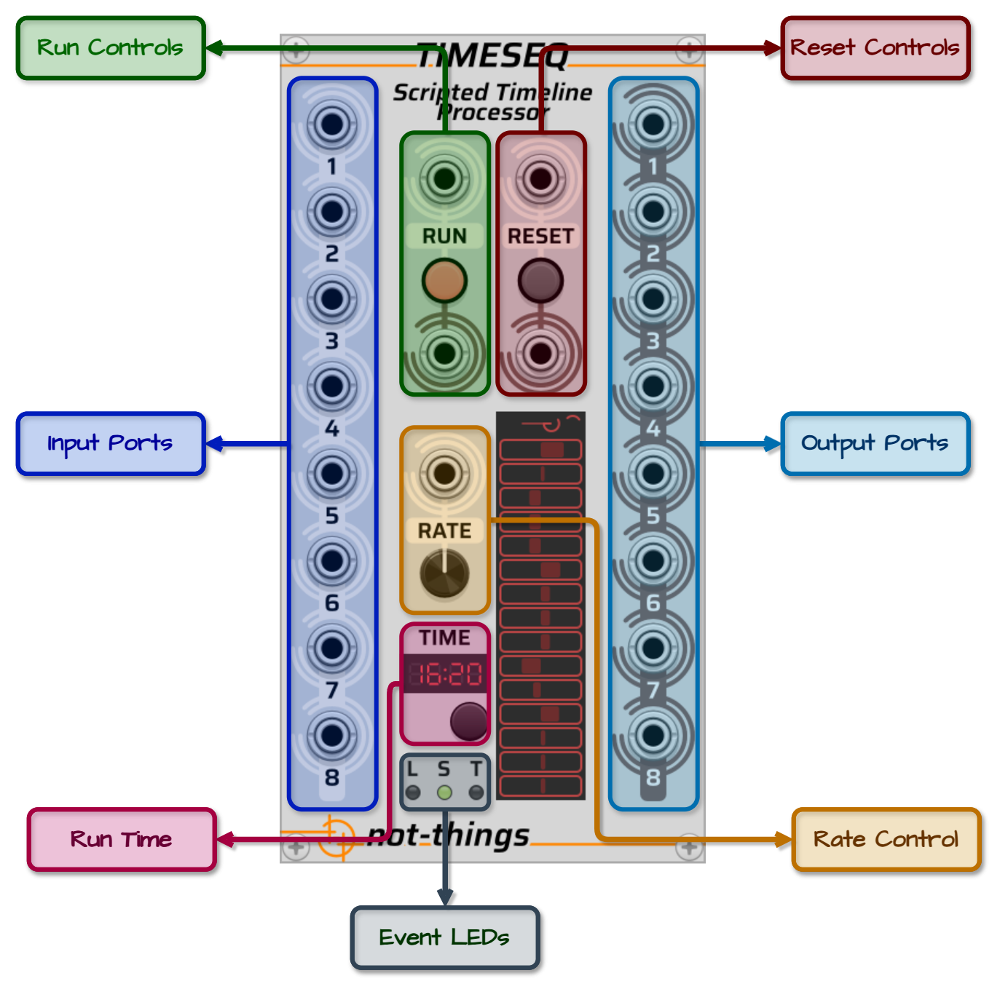
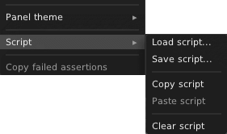

# TIMESEQ UI PANEL

*An overview of the UI for the not-things [TimeSeq](../TIMESEQ.md) module.*

## Table of Contents

* [TimeSeq Controls](#timeseq-controls)
* [Script Loading](#script-loading)
* [Status Display](#status-display)
* [Input Ports and Channels](#input-and-output-ports-and-channels)
* [Rate Control](#rate-control)
* [Asserts](#asserts)

## TimeSeq Controls

The TimeSeq panel has following controls:

* **Run Controls**:
  * *Input Port*: If a script is currently loaded but not running, a trigger on the input port will start/continue the script. If the script is already currently running, the trigger will pause it. If no valid script is loaded, the input will have no impact.
  * *LED Button*: The LED will light up when a script is loaded and running or dim when no script is loaded or it is paused. Clicking the button will have the same impact as a trigger on the Run input port: if a script is running, it will be paused and if it is stopped or paused, it will start or continue.
  * *Output Port*: A trigger signal is sent on the output port any time the run state of the script is changed.
* **Reset Controls**:
  * *Input Port*: If a script is loaded, a trigger on the input port will cause the progress of the script to be reset and any variables and internal triggers to be cleared. After a reset, the script will be in the same state as if it was just loaded. If the script was running before the reset was triggered, the script start running again after the reset.
  * *LED Button*: The LED will light up when the button is pressed or if a trigger is received on the Reset input port. Clicking the button will have the same impact as a trigger on the Reset input port: it will reset the script state.
  * *Output Port*: A trigger signal is sent on the output port any time the script is reset.
* **Input Ports**: Eight polyphonic input ports that can be used by the script to receive external voltages and triggers.
* **Output Ports**: Eight polyphonic output ports that can be controlled by the script. When a script is loaded or reset, all output ports will be set to their default state: monophonic (i.e. contain 1 channel), and all outputs are set to 0V.
* **Rate control**: The rate controls allow the active script to be processed faster or slower then real-time rate. The rate dial can be set to a value from -10 to 10. If a cable is connected to the Rate input port, the input signal will overwrite the currently assigned value of the Rate dial. In this case, the voltage on the input port (rounded down) will be used as rate value. See [Rate Control](#rate-control) for more details about how it influences script processing.
* **Run Time**: The time display shows how long a script has been running in minutes and seconds. The display will wrap every hour. Time will not advance when a script is paused, and changing the [rate](#rate-control) of TimeSeq will also influence the rate of the time display. The button below the Time display will reset the timer, but will not influence the running state or position of the currently loaded script.
* **Event LEDs**: Three event LEDs at the bottom of TimeSeq will fire when certain events occur during the execution of a script:
  * The ***L*** LED will blink if a [lane](TIMESEQ-SCRIPT-JSON.md#lane) loops
  * The ***S*** LED will blink if a [segment](TIMESEQ-SCRIPT-JSON.md#segment) starts
  * The ***T*** LED will blink if an internal [trigger](TIMESEQ-SCRIPT.md#triggers) was fired

## Script Loading

The loading of a TimeSeq script is done through the right-click menu of the module.

In the `Script` sub-menu, there are options to:

* **Load script** from a file
* **Save script** (that is currently loaded) to a file
* **Copy script** (that is currently loaded) to the clipboard
* **Paste script** from the clipboard
* **Clear script** to remove the current script from TimeSeq

Any script that is loaded or pasted will be validated first. See [Script Errors](TIMESEQ-SCRIPT.md#script-errors) on the *TimeSeq Script* page for more details about error handling during the loading of a script.

When working on a script, using the **Paste** option allows faster edit-paste-and-test iterations to test changes when compared to going through a save-load-and-test file flow.

## Status Display

The status display that can be found in the lower section of TimeSeq will provide running information from the core script processor. The top line will show the status of the processor:

* ***EMPTY*** if no script is loaded
* ***ERROR*** if a script was loaded/pasted that contained errors (and no other script was loaded before)
* ***PAUSED*** if a script is loaded but is currently not running
* A simple ***animation*** if a script is loaded and running
* ***ASSERT*** if an [assert](#asserts) was triggered by the current script.

Below this, TimeSeq provides visual feedback of output voltages. Each time a [set-value](TIMESEQ-SCRIPT-JSON.md#set-value) action updates a channel on an output port, that channel is added to the display. Channels appear from bottom to top in the order they are first updated.
Each channel is shown as a horizontal line that represents its voltage current voltage, ranging from -10V to +10V, with 0V centered. If a channel already appears on the display and receives another update, its line is refreshed in place with the new voltage.
When no further *set-value* actions are performed on a channel, its voltage indicator will begin to fade out gradually. After a period of inactivity, the channel is removed from the display entirely.

This visual feedback is intended to give a quick impression of sequencing activity within TimeSeq. It is not designed for precise monitoring of voltage values.

## Input and Output Ports and Channels

TimeSeq has eight input ports and eight output ports. Each port supports up to 16 channels, allowing for a total of 128 input channels and 128 output channels. While this provides a large number of channels, the number of ports may become a limitation in more complex patches, especially when many separate cables or modules need to connect to TimeSeq.

The [PI-PO](../PIPO.md) modules were created to solve this. They let you split and merge polyphonic cables in flexible ways, effectively extending the input and output capabilities of TimeSeq.

For example, suppose your patch needs 16 cables, each carrying 4-channel polyphonic signals, all coming from TimeSeq. Instead of using 16 individual output ports (which TimeSeq doesn't support), you can write the script so that each of TimeSeq's 8 output ports carries 8 channels - enough for two 4-channel signals per port.

You can then use one P-I module to receive all 8 TimeSeq output ports, and route them to two P-O modules. These will split the channels across 16 outputs, each carrying the required 4 channels, all while preserving channel assignments and polyphony.

This setup keeps your cable usage efficient while letting you scale beyond the base 8-port limit.

## Rate Control

Under normal processing conditions, TimeSeq performs one processing cycle for each sample in the sample rate of VCV Rack. The rate control can be used to change this: if it is set to a value above `1`, TimeSeq will instead perform multiple processing cycles for each VCV Rack sample, which will cause the script to speed up. Setting the rate to `2` will make it run at double speed, `3` will make it run three times as fast, etc.

Negative values on the other hand will cause the processing cycle to be executed less frequently, slowing down script execution. A `-2` rate will cause one processing cycle to be performed every two VCV Rack samples, a `-3` rate will result in one cycle every three samples.

If the rate is set to `-1`, `0` or `1`, the script will be processed at the normal speed.

The main target for the rate control is to facilitate testing of longer sequences: when working on a script that spans several minutes, testing changes near the end of a script would require several minutes of waiting to verify each change. The rate control allows faster iterations in these kinds of scenarios by fast forwarding through a script. The rate control can however also be used in other creative ways due to the availability of direct CV control over the speed. If a cable is connected to the CV input, its input voltage will overwrite the value set on the dial. The input voltage will be rounded down and limited to a value between -10 and 10.

Something to take into account when increasing the rate is that since multiple processing cycles will be executed within one VCV Rack sample, the state of the output ports will only be evaluated by VCV Rack once all these processing cycles have been completed. While all internal changes (such as triggers, variable changes and voltage changes) will still work as normal in between each processing cycle, any module that is connected to the TimeSeq outputs will only receive the state of the output ports once the VCV Rack sample is completed, and thus after all the (accelerated) processing cycles in that sample have completed. Thus when multiple changes are done on the same output port channel, only the last voltage value will be picked up by other modules. For this reason, when scripting a gate or trigger on an output port, make sure that it lasts for more than 10 samples, so it will still work when the rate control is increased (Note: the [VCV Rack Voltage Standards](https://vcvrack.com/manual/VoltageStandards#:~:text=Trigger%20sources%20should%20produce%2010,a%20duration%20of%201%20ms.) suggests trigger durations of 1ms).

## Asserts

Asserts allow a special use case of the TimeSeq module: instead of being used as a sequencer, TimeSeq can also be used to verify the functionality of other modules by including [assert](TIMESEQ-SCRIPT-JSON.md#assert)s in the script with an expected [condition](TIMESEQ-SCRIPT-JSON.md#if). If the *condition* evaluates to `false`, the TimeSeq [Status Display](#status-display) will change to ***ASSERT*** and the script execution can optionally be stopped. When an assert is triggered, its name and the exact values of the failed condition can be retrieved using the ***Copy failed assertions*** entry in the TimeSeq right-click menu.

If the script is not paused due to the fired assert, it is possible that multiple asserts will be triggered as the script keeps running. In this case, TimeSeq will keep the information for the first 25 asserts in memory for retrieval through the ***Copy failed assertions*** menu option.

Testing the expected behaviour of a module can thus be done by writing a script that generates voltages on the output ports, connecting these with the module that is to be tested, and subsequently verifying the expected voltages on the output ports of the to-be-tested module by connecting them back to the input ports of TimeSeq and validating their voltages using assert actions.

Note that due to the way VCV Rack works, any cable connection in VCV Rack will introduce a 1 sample delay in the processing chain. When setting an output port voltage and subsequently verifying the resulting input voltage, sufficient time has to be foreseen for the signal to reach the other module, that module to perform its processing and the resulting output to reach TimeSeq again.
